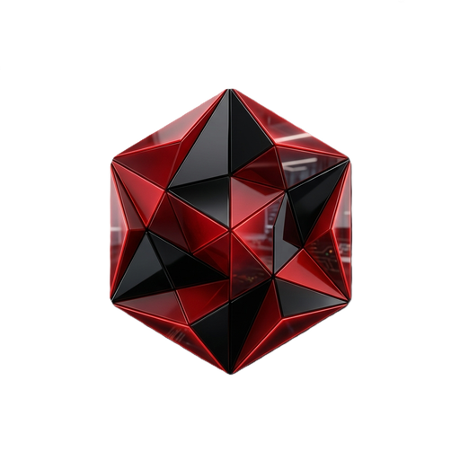

  

<h1 align="center">DevPrism</h1>

  An offline-first scientific writing workspace powered by your local LLM (Ollama). 
  LaTeX + Python + scientific & custom skills + project spaces — runs entirely on your desktop.

  <a href="./README.md">English</a> ·
  <a href="./README.ko.md">한국어</a> ·
  <a href="./README.ja.md">日本語</a> ·
  <a href="./README.zh-CN.md">简体中文</a>

  

  &nbsp;
  &nbsp;
  &nbsp;
  &nbsp;
  

  

---

## Why DevPrism?

[OpenAI Prism](https://openai.com/prism/) is a cloud-based LaTeX workspace — all your files and data must be uploaded to OpenAI's servers to use it.

DevPrism is a **fully local** alternative — your files are stored on your disk, compiled offline, and the AI runs on your own machine via [Ollama](https://ollama.com). By default nothing leaves your computer. Cloud providers (Anthropic, OpenAI, and OpenAI-compatible endpoints) remain available as opt-in choices in Settings.

| | OpenAI Prism | DevPrism |
|---|:---:|:---:|
| AI Model | GPT-5.2 (cloud) | **Local via Ollama (llama3, qwen, mistral, …) — cloud optional** |
| Privacy | Files uploaded to cloud | **Runs offline; no data leaves your machine by default** |
| Runtime | Browser (cloud) | **Native desktop (Tauri 2 + Rust)** |
| LaTeX | Cloud compilation | **Tectonic (embedded, offline)** |
| Python Environment | — | **Built-in uv + venv — one-click scientific Python setup** |
| Skills | — | **Scientific skills + bundled offline DevPrism skills + custom skills on the go** |
| Project Spaces | — | **Group projects with a shared default model & skills** |
| Getting Started | Account setup required | **Install and go — template gallery + project wizard** |
| Version Control | — | **Git-based history with labels & diff** |
| Source Code | Proprietary | **Open source (MIT)** |

### Data & Privacy

DevPrism stores and compiles your documents locally, and by default runs inference on a **local Ollama model** — so prompts and file contents never leave your machine. If you opt into a cloud provider (Anthropic, OpenAI, or any OpenAI-compatible endpoint) in Settings, prompts and the files the model reads are sent to that provider for inference, like any cloud LLM tool. Choose the provider that matches your privacy needs.

---

## Features

### Python Environment (uv)
DevPrism integrates [uv](https://docs.astral.sh/uv/) — the fast Python package manager — directly into the app. One click to install uv, one click to create a project-level virtual environment. The local agent automatically uses the `.venv` when running Python code, so you can generate plots, run analysis scripts, and process data without leaving the editor.

  

### 100+ Scientific Skills
Browse and install domain-specific skills from [K-Dense Scientific Skills](https://github.com/K-Dense-AI/claude-scientific-skills) — curated prompts and tool configurations that give Claude deep knowledge in specialized fields:

| Domain | Skills |
|--------|--------|
| **Bioinformatics & Genomics** | Scanpy, BioPython, PyDESeq2, PySAM, gget, AnnData, ... |
| **Cheminformatics & Drug Discovery** | RDKit, DeepChem, DiffDock, PubChem, ChEMBL, ... |
| **Data Analysis & Visualization** | Matplotlib, Seaborn, Plotly, Polars, scikit-learn, ... |
| **Machine Learning & AI** | PyTorch Lightning, Transformers, SHAP, UMAP, PyMC, ... |
| **Clinical Research** | ClinicalTrials.gov, ClinVar, DrugBank, FDA, ... |
| **Scientific Communication** | Literature Review, Grant Writing, Citation Management, ... |
| **Multi-omics & Systems Biology** | scvi-tools, COBRApy, Reactome, Bioservices, ... |
| **And more** | Materials Science, Lab Automation, Proteomics, Physics, ... |

Skills are installed globally (`~/.claude/skills/`) or per-project, and the agent automatically loads them when relevant.

DevPrism also ships its own **bundled, fully-offline skill packages** — `resume-cv`, `manuscript-paper`, `statement-authoring`, `latex-toolkit`, `thesis`, `beamer-slides`, and `project-space` — each with ready-to-compile LaTeX templates. Install them from the project's **Environment → DevPrism skills** panel, or **create your own custom skill on the go** (name, description, steps) without leaving the app.

  

### Quick Start with Templates & Project Wizard
Pick a template (paper, thesis, presentation, poster, letter, etc.), give it a name, optionally describe what you're writing — DevPrism sets up the project and generates initial content with AI. Drag & drop reference files (PDF, BIB, images) and start writing immediately.

  

### Local-First AI Assistant
Chat with a model running locally on your machine via **Ollama** — DevPrism auto-detects your installed models, so there's no hardcoded default and no API key required. Prefer a cloud model? Pick Anthropic, OpenAI, or any OpenAI-compatible endpoint in Settings. Persistent sessions, tool use (file edit, bash, search), adjustable reasoning effort, and extensible slash commands.

Turn on the **native local agent** (Settings → Provider) to run the whole agentic loop in-process against Ollama with **no Claude CLI and no proxy** — fully offline and self-contained, with its own Rust tools (Read/Write/Edit/LS/Grep/Glob/Bash), conversation memory, vision support, and tunable `num_ctx`/temperature. See [docs/NATIVE_AGENT.md](docs/NATIVE_AGENT.md).

### Project Spaces
Group related projects into named **spaces** (e.g. *PhD Papers*, *Job Applications*) — each with its own color, default model, and attached skills. Filter the project picker by space, move projects between spaces, and one-click install a space's skills into all its projects.

  

### History & Proposed Changes
Every save creates a snapshot in a local Git repository (`.claudeprism/history.git/`). Label important checkpoints, browse diffs between any two snapshots, and restore previous versions. When Claude suggests edits, changes appear in a dedicated panel with visual diffs — accept or reject per chunk, or apply/undo all at once (`⌘Y` / `⌘N`).

  

### Offline LaTeX Compilation
Tectonic is embedded directly in the app. Packages are downloaded once on first use and cached locally. After that, compilation works fully offline with no TeX Live installation required.

### Capture & Ask
Press `⌘X` to enter capture mode, drag to select any region in the PDF — the captured image is pinned to the chat composer so you can immediately ask Claude about it. Great for asking about equations, figures, tables, or reviewer comments.

  

### Live PDF Preview
Native MuPDF rendering with SyncTeX support — click a position in the PDF to jump to the corresponding source line. Supports zoom, text selection, and capture.

### Editor
CodeMirror 6 with LaTeX/BibTeX syntax highlighting, real-time error linting, find & replace (regex), and multi-file project support with auto-save.

### More
- **Zotero Integration** — OAuth-based bibliography management and citation insertion.

  

- **Slash Commands** — Built-in (`/review`, `/init`) + custom commands from `.claude/commands/`.
- **External Editors** — Open projects in Cursor, VS Code, Zed, or Sublime Text.
- **Dark / Light Theme** — Automatic switching.

---

## Installation

Download the latest build from [GitHub Releases](https://github.com/bharathvbcr/DevPrism/releases).

## Contributing

Contributions are welcome! See [CONTRIBUTING.md](./CONTRIBUTING.md) for development setup, testing, and guidelines.

## Acknowledgments

DevPrism is forked from [claude-prism](https://github.com/delibae/claude-prism) by [delibae](https://github.com/delibae), which itself began as a fork of [Open Prism](https://github.com/assistant-ui/open-prism) by [assistant-ui](https://github.com/assistant-ui). It stands on the shoulders of many excellent open-source projects. Huge thanks to the maintainers and communities behind:

**Foundation**
- [claude-prism](https://github.com/delibae/claude-prism) by [delibae](https://github.com/delibae) — the direct upstream DevPrism is forked from.
- [Open Prism](https://github.com/assistant-ui/open-prism) by [assistant-ui](https://github.com/assistant-ui) — the original project claude-prism is based on.

**Desktop & UI**
- [Tauri](https://tauri.app) — the Rust-based desktop application framework.
- [React](https://react.dev) + [Vite](https://vitejs.dev) — frontend runtime and build tooling.
- [CodeMirror 6](https://codemirror.net) — the LaTeX/BibTeX source editor.
- [Radix UI](https://www.radix-ui.com) & [Tailwind CSS](https://tailwindcss.com) — component primitives and styling.

**Scientific & Document Engine**
- [Tectonic](https://tectonic-typesetting.github.io) — the embedded, offline LaTeX engine.
- [MuPDF](https://mupdf.com) — native PDF rendering with SyncTeX support.
- [uv](https://docs.astral.sh/uv/) by [Astral](https://astral.sh) — the fast Python package manager powering the built-in Python environment.

**AI & Skills**
- [Ollama](https://ollama.com) — local LLM runtime that powers offline, on-device inference.
- [Anthropic Claude](https://www.anthropic.com/claude) — the assistant behind the optional cloud agent and slash commands.
- [K-Dense Scientific Skills](https://github.com/K-Dense-AI/claude-scientific-skills) by [K-Dense AI](https://github.com/K-Dense-AI) — the 100+ domain-specific scientific skills.

**Integrations**
- [Zotero](https://www.zotero.org) — bibliography management and citation insertion.

And the broader open-source ecosystem of libraries this project depends on — thank you. 🙏

## License

[MIT](./LICENSE) © 2026 delibae. Portions © 2025 [assistant-ui](https://github.com/assistant-ui) (Open Prism).
