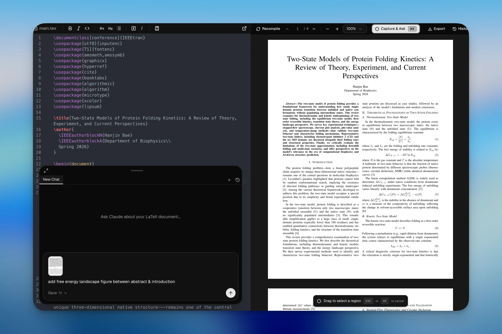
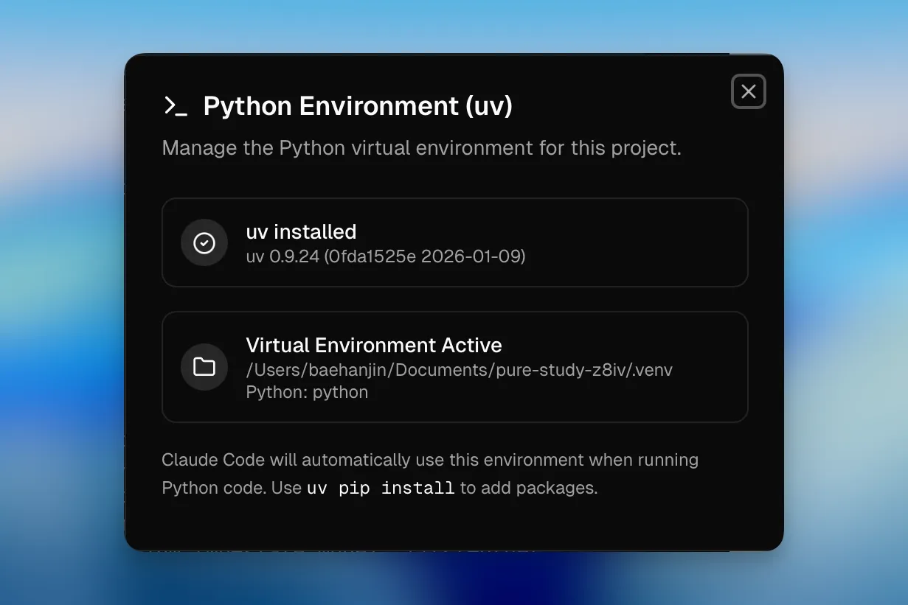
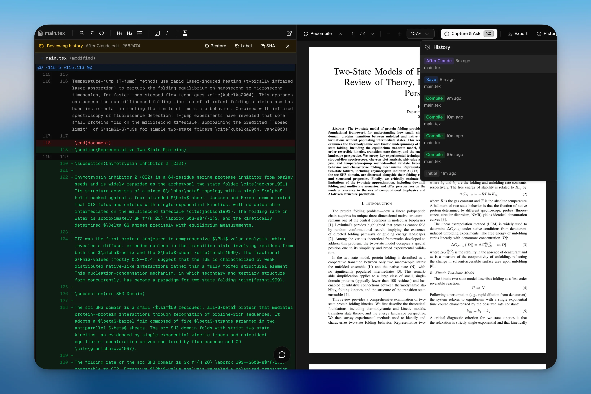

<p align="center">
  
</p>

<h1 align="center">DevPrism</h1>

<p align="center">
  A local-first desktop workspace for technical writing, LaTeX projects, research notes, and AI-assisted document work.
</p>

<p align="center">
  <a href="./README.md">English</a> ·
  <a href="./README.ko.md">한국어</a> ·
  <a href="./README.ja.md">日本語</a> ·
  <a href="./README.zh-CN.md">简体中文</a>
</p>

<p align="center">
  
</p>

<p align="center">
  <a href="https://github.com/bharathvbcr/DevPrism">
    
  </a>&nbsp;
  <a href="https://github.com/bharathvbcr/DevPrism/releases/latest/download/DevPrism-macOS.dmg">
    
  </a>&nbsp;
  <a href="https://github.com/bharathvbcr/DevPrism/releases/latest/download/DevPrism-macOS-Intel.dmg">
    
  </a>&nbsp;
  <a href="https://github.com/bharathvbcr/DevPrism/releases/latest/download/DevPrism-Windows-setup.exe">
    
  </a>&nbsp;
  <a href="https://github.com/bharathvbcr/DevPrism/releases/latest/download/DevPrism-Linux.AppImage">
    
  </a>
</p>

<p align="center">
  <a href="https://github.com/bharathvbcr/DevPrism/releases">
    
  </a>
</p>

---

## What DevPrism Is

DevPrism is a native desktop environment for writing and revising technical documents without handing the whole workflow to a hosted editor. It combines a LaTeX editor, PDF preview, project templates, local project history, AI chat, Python tooling, and research-oriented skills in one Tauri app.

The goal is practical: keep project files on disk, make document compilation and review fast, and let AI help with edits, explanations, analysis, and project automation when you choose to enable it.

## Why Use It

- **Local project ownership:** documents, templates, snapshots, and project configuration live in your workspace.
- **Offline-capable LaTeX:** the app uses embedded Tectonic support, with packages cached after first use.
- **AI when useful:** use Gemini API for hosted model access or Ollama for local inference.
- **Built for research workflows:** add scientific skills, manage references, run Python analysis, and keep writing context close to the document.
- **Change control:** assistant edits are staged as proposed changes, and project history is backed by a local Git repository.

## Core Workflow

1. Create a project from a template such as a paper, thesis, report, poster, presentation, CV, or blank document.
2. Write in the LaTeX/BibTeX editor with live linting, search, auto-save, and PDF preview.
3. Ask the assistant to review text, edit files, explain errors, generate snippets, or work with selected PDF regions.
4. Accept or reject proposed edits chunk by chunk.
5. Label checkpoints and compare project history when you need to recover or audit changes.

## Features

### Writing Workspace

DevPrism provides a CodeMirror-based LaTeX editor, BibTeX syntax support, real-time problem reporting, multi-file project navigation, PDF preview, zoom, text selection, and SyncTeX-style navigation between source and rendered output.

### Assistant Chat

The assistant drawer supports persistent sessions, provider selection, project-aware tool use, slash commands, and proposed file changes. It is designed for document work rather than generic chat bolted onto an editor.

### Capture & Ask

Use capture mode to select a region of the PDF and attach it directly to the assistant. This is useful for equations, figure details, table checks, reviewer comments, or layout questions.

<p align="center">
  
</p>

### Templates & Project Wizard

Start from bundled document templates and let the project wizard create the initial folder structure. Templates cover common technical and academic formats, including papers, reports, theses, posters, presentations, letters, newsletters, books, and CVs.

<p align="center">
  
</p>

### Python Environment

DevPrism includes uv-based Python setup for project analysis and figure generation. A project-level `.venv` can be created from the app, then reused by assistant tools and scripts.

<p align="center">
  
</p>

### Scientific Skills

Install domain-specific skills globally or per project. Skills can provide focused assistance for literature review, citation work, bioinformatics, cheminformatics, clinical research, machine learning, visualization, and other research tasks.

<p align="center">
  
</p>

### History & Review

Each save can be captured into `.devprism/history.git/`. You can label checkpoints, inspect diffs, restore previous states, and review assistant-generated edits before applying them.

<p align="center">
  
</p>

### Zotero

DevPrism includes Zotero integration for bibliography workflows and citation insertion.

<p align="center">
  
</p>

## Privacy Model

DevPrism is local-first, not magic-air-gapped. Files are stored and compiled locally by default. If you enable a hosted AI provider, prompts and relevant project context can be sent to that provider. For fully local inference, configure Ollama and keep hosted model providers disabled.

Runtime paths:

- Project history: `.devprism/history.git/`
- Project skills: `.devprism/skills/`
- User settings and global skills: `~/.devprism/`
- Project Python environment: `.venv/`

## Installation

Download the latest build from [GitHub Releases](https://github.com/bharathvbcr/DevPrism/releases).

Available release artifacts are expected for:

- macOS Apple Silicon
- macOS Intel
- Windows
- Linux AppImage

## Development

Install dependencies:

```bash
pnpm install --frozen-lockfile
```

Run common checks:

```bash
pnpm lint
pnpm --filter @devprism/desktop test
pnpm --filter @devprism/desktop build
```

Run the desktop app in development:

```bash
pnpm dev
```

Build native packages:

```bash
pnpm build
```

## Architecture

DevPrism is built with Tauri 2, Rust, React, Vite, and TypeScript.

- The React frontend owns the editor, PDF preview, template gallery, assistant UI, settings, and project workflows.
- The Rust host owns filesystem access, native app lifecycle, LaTeX compilation, SyncTeX plumbing, local history, skill installation, uv setup, Zotero OAuth, and privileged tool execution.

See [docs/ARCHITECTURE.md](./docs/ARCHITECTURE.md) for the module map and [docs/RELEASE.md](./docs/RELEASE.md) for release packaging notes.

## Contributing

Contributions are welcome. See [CONTRIBUTING.md](./CONTRIBUTING.md) for setup, testing, and contribution guidelines.

## Acknowledgments

DevPrism builds on the ideas and foundation of Claude Prism / Open Prism by [assistant-ui](https://github.com/assistant-ui), including the original local AI writing workspace direction. This project has been reworked under the DevPrism brand with its own documentation, packaging, feature scope, and release path.

## License

[MIT](./LICENSE)
