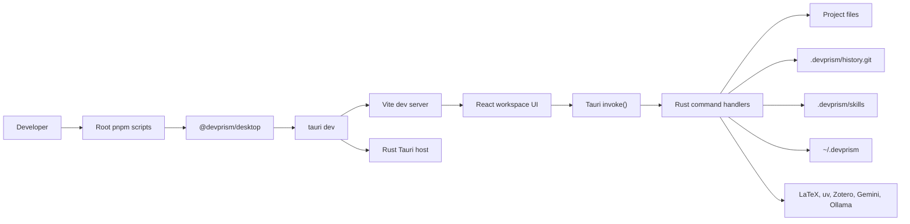
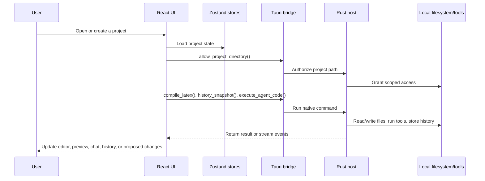
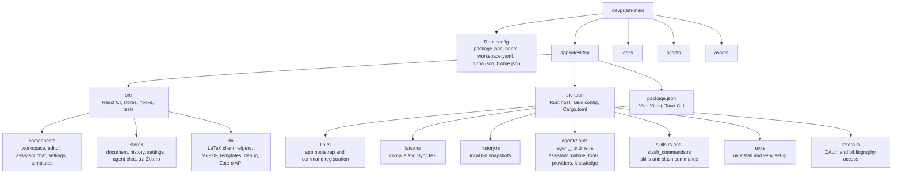
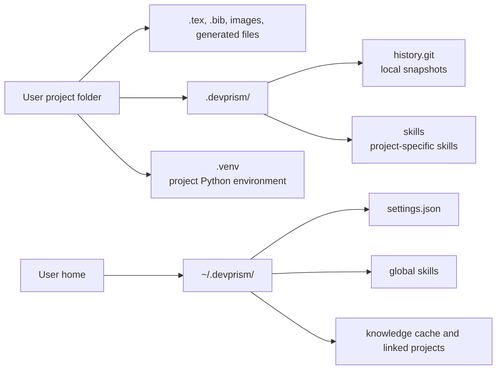
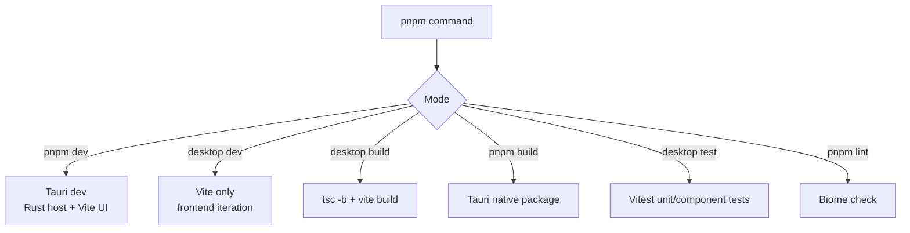

<p align="center">
  
</p>

# <h1 align="center">DevPrism</h1>

<p align="center">
  A local-first desktop workspace for technical writing, LaTeX projects, research notes, and AI-assisted document work.
</p>

<p align="center">
  <a href="./README.md">English</a> ·
  <a href="./README.ko.md">한국어</a> ·
  <a href="./README.ja.md">日本語</a> ·
  <a href="./README.zh-CN.md">简体中文</a>
</p>

<p align="center">
  
</p>

<p align="center">
  <a href="https://github.com/bharathvbcr/DevPrism">
    
  </a>&nbsp;
  <a href="https://github.com/bharathvbcr/DevPrism/releases/latest/download/DevPrism-macOS.dmg">
    
  </a>&nbsp;
  <a href="https://github.com/bharathvbcr/DevPrism/releases/latest/download/DevPrism-macOS-Intel.dmg">
    
  </a>&nbsp;
  <a href="https://github.com/bharathvbcr/DevPrism/releases/latest/download/DevPrism-Windows-setup.exe">
    
  </a>&nbsp;
  <a href="https://github.com/bharathvbcr/DevPrism/releases/latest/download/DevPrism-Linux.AppImage">
    
  </a>
</p>

<p align="center">
  <a href="https://github.com/bharathvbcr/DevPrism/releases">
    
  </a>
</p>

---

## What DevPrism Is

DevPrism is a native desktop environment for writing and revising technical documents without handing the whole workflow to a hosted editor. It combines a LaTeX editor, PDF preview, project templates, local project history, AI chat, Python tooling, and research-oriented skills in one Tauri app.

The goal is practical: keep project files on disk, make document compilation and review fast, and let AI help with edits, explanations, analysis, and project automation when you choose to enable it.

## Why Use It

- **Local project ownership:** documents, templates, snapshots, and project configuration live in your workspace.
- **Local LaTeX compilation:** Windows builds use TeXLive; other builds can use embedded Tectonic when that feature is enabled.
- **AI when useful:** use Gemini API for hosted model access or Ollama for local inference.
- **Built for research workflows:** add scientific skills, manage references, run Python analysis, and keep writing context close to the document.
- **Change control:** assistant edits are staged as proposed changes, and project history is backed by a local Git repository.

## Core Workflow

1. Create a project from a template such as a paper, thesis, report, poster, presentation, CV, or blank document.
2. Write in the LaTeX/BibTeX editor with live linting, search, auto-save, and PDF preview.
3. Ask the assistant to review text, edit files, explain errors, generate snippets, or work with selected PDF regions.
4. Accept or reject proposed edits chunk by chunk.
5. Label checkpoints and compare project history when you need to recover or audit changes.

## Features

### Writing Workspace

DevPrism provides a CodeMirror-based LaTeX editor, BibTeX syntax support, real-time problem reporting, multi-file project navigation, PDF preview, zoom, text selection, and SyncTeX-style navigation between source and rendered output.

### Assistant Chat

The assistant drawer supports persistent sessions, provider selection, project-aware tool use, slash commands, and proposed file changes. It is designed for document work rather than generic chat bolted onto an editor.

### Capture & Ask

Use capture mode to select a region of the PDF and attach it directly to the assistant. This is useful for equations, figure details, table checks, reviewer comments, or layout questions.

<p align="center">
  
</p>

### Templates & Project Wizard

Start from bundled document templates and let the project wizard create the initial folder structure. Templates cover common technical and academic formats, including papers, reports, theses, posters, presentations, letters, newsletters, books, and CVs.

<p align="center">
  
</p>

### Python Environment

DevPrism includes uv-based Python setup for project analysis and figure generation. A project-level `.venv` can be created from the app, then reused by assistant tools and scripts.

<p align="center">
  
</p>

### Scientific Skills

Install domain-specific skills globally or per project. Skills can provide focused assistance for literature review, citation work, bioinformatics, cheminformatics, clinical research, machine learning, visualization, and other research tasks.

<p align="center">
  
</p>

### History & Review

Each save can be captured into `.devprism/history.git/`. You can label checkpoints, inspect diffs, restore previous states, and review assistant-generated edits before applying them.

<p align="center">
  
</p>

### Zotero

DevPrism includes Zotero integration for bibliography workflows and citation insertion.

<p align="center">
  
</p>

## Additional App Features

### Project & File Management

- Open existing folders or start a guided setup from the project picker.
- Keep a recent-project list for fast reopening.
- Create, rename, delete, move, and import project files from the sidebar.
- Organize documents with nested folders and drag-and-drop file movement.
- Import common project assets such as `.tex`, `.bib`, `.sty`, `.cls`, `.bst`, images, PDFs, Markdown, and text files.
- Paste files from the OS clipboard into the project file tree on supported platforms.
- Parse the active LaTeX document into a sidebar outline from `\part`, `\chapter`, `\section`, `\subsection`, and `\subsubsection` headings.
- Switch between light, dark, and system themes.

### Editor & Preview Details

- Use toolbar actions for common LaTeX inserts: bold, italic, code, sections, subsections, list items, inline math, display math, and citations.
- Preview PDFs with page rendering backed by MuPDF.
- Preview image assets directly in the editor pane.
- Zoom images from 50% to 400%.
- Crop non-SVG images from the app UI.
- Open the active project or file in external editors when installed: Cursor, VS Code, Zed, or Sublime Text.

### Assistant Runtime

- Run assistant sessions against Gemini API, Gemini CLI, Codex CLI, or Ollama.
- Check provider health from Settings before relying on a model.
- Keep persistent chat sessions and reload prior session history.
- Resume or cancel long-running assistant work.
- Display assistant tool activity with dedicated widgets for reads, writes, edits, shell commands, searches, todo updates, and user questions.
- Stage assistant edits as proposed changes instead of silently overwriting project files.
- Use slash commands from global skills, project skills, and manually authored skills.

### Knowledgebase & Resume Context

- Link external projects into the DevPrism knowledgebase with role, tags, description, and project metadata.
- Analyze linked Git projects for commit history, change categories, top changed files, and detected tech stack.
- Store durable project summaries and evidence observations in the local knowledge cache.
- Maintain resume-oriented context: personal bio, target profile, manual experience, and evidence entries.
- Import and export a portable knowledgebase JSON bundle for moving project context between machines.
- Omit API keys from knowledgebase exports while preserving portable provider and security preferences.

### Security & Control

- Redact common secret patterns before hosted model calls when redaction is enabled.
- Enable safe mode to require confirmation before shell commands or file edits.
- Approve or reject pending assistant actions from the in-app safe-mode dialog.
- Restrict assistant filesystem access to the current project plus explicitly authorized paths.
- Add and remove extra authorized paths from Settings.
- Keep hosted AI optional: Ollama can be used for local inference, while Gemini and Codex providers are opt-in runtime choices.

### Python, Skills, and Automation

- Detect uv and install it from the app when needed.
- Auto-create a project `.venv` after opening a project when uv is ready.
- Add Python packages to the project environment and run uv-backed commands.
- Install scientific skills globally or per project.
- Browse scientific skill categories and inspect installed skill content.
- Add manual skills directly from Settings, scoped globally or to the current project.
- Use project/global slash commands to turn repeatable research and writing workflows into reusable commands.

### Updates, Diagnostics, and Reliability

- Check for app updates from the project picker and install available updater releases.
- Open multiple DevPrism windows with the global new-window shortcut.
- Generate structured debug reports with system info, GPU/render state, visibility events, and recent app logs.
- Toggle an in-app debug panel for troubleshooting render and runtime issues.
- Recover from some native webview repaint issues by forcing focus-restore refresh behavior on macOS.
- Clean up LaTeX build temp directories on app exit.

## Keyboard Shortcuts

| Shortcut | Action |
| --- | --- |
| `Cmd/Ctrl+S` | Save the current file |
| `Cmd/Ctrl+Shift+N` | Open a new DevPrism window |
| `Cmd/Ctrl+X` | Toggle Capture & Ask mode |
| `Cmd/Ctrl+Shift+D` | Toggle the debug panel |
| `Cmd/Ctrl++` | Zoom the app UI in |
| `Cmd/Ctrl+-` | Zoom the app UI out |
| `Cmd/Ctrl+0` | Reset app UI zoom |
| `Cmd/Ctrl+V` in the file tree | Paste file paths from the OS clipboard when available |

## Supported Integrations

| Integration | Purpose |
| --- | --- |
| Gemini API | Hosted assistant provider and semantic-search embeddings |
| Gemini CLI | CLI-backed hosted assistant workflow |
| Codex CLI | CLI-backed coding and project assistant workflow |
| Ollama | Local model provider |
| uv | Python runtime setup, package install, and project command execution |
| TeXLive | Local LaTeX compilation, especially on Windows builds |
| Tectonic | Optional embedded LaTeX compiler feature for supported builds |
| Zotero | OAuth-backed bibliography and citation access |
| Cursor, VS Code, Zed, Sublime Text | External editor handoff from the active project/file |

## Privacy Model

DevPrism is local-first, not magic-air-gapped. Files are stored and compiled locally by default. If you enable a hosted AI provider, prompts and relevant project context can be sent to that provider. For fully local inference, configure Ollama and keep hosted model providers disabled.

Runtime paths:

- Project history: `.devprism/history.git/`
- Project skills: `.devprism/skills/`
- User settings and global skills: `~/.devprism/`
- Project Python environment: `.venv/`
- Knowledge cache, linked projects, and portable app context: `~/.devprism/`
- App provider settings, safe-mode settings, resume context, and manual skills: `~/.devprism/`

Security notes:

- Knowledgebase export intentionally clears `geminiApiKey` instead of writing the key into the bundle.
- Semantic search embeddings use Gemini's embedding API and require `GEMINI_API_KEY`, even when chat is configured for Gemini CLI, Codex CLI, or Ollama.
- Hosted providers can receive prompts, selected context, and relevant project snippets. Keep hosted providers disabled when work must remain fully local.
- Safe mode and authorized paths are runtime controls for assistant actions; they are not a substitute for reviewing proposed changes before applying them.

## Installation

Download the latest build from [GitHub Releases](https://github.com/bharathvbcr/DevPrism/releases).

Available release artifacts are expected for:

- macOS Apple Silicon
- macOS Intel
- Windows
- Linux AppImage

## Development

DevPrism is a pnpm workspace with one main app package:

- Root workspace: `devprism`
- Desktop app: `apps/desktop`
- Frontend runtime: React 19, TypeScript, Vite, Zustand, CodeMirror, MuPDF
- Native host: Tauri 2 and Rust
- Package manager: `pnpm@10.28.2`

### Prerequisites

Install these before running the repo locally:

- Node.js with pnpm enabled
- Rust stable toolchain
- Tauri 2 system prerequisites for your OS
- A LaTeX toolchain if you want document compilation in development
  - Windows builds use TeXLive detection.
  - Tectonic can be compiled through the optional Rust feature, but it needs native font/text shaping libraries.
- Optional model/tooling runtimes:
  - Gemini API key or Gemini CLI for hosted assistant workflows
  - Ollama for local assistant workflows
  - uv for project Python environments
  - Zotero for bibliography workflows

Install dependencies:

```bash
pnpm install --frozen-lockfile
```

Run common checks:

```bash
pnpm lint
pnpm --filter @devprism/desktop test
pnpm --filter @devprism/desktop build
```

Run the desktop app in development:

```bash
pnpm dev
```

That root command delegates to:

```bash
pnpm --filter=@devprism/desktop tauri dev
```

For frontend-only iteration inside the desktop package:

```bash
pnpm --filter @devprism/desktop dev
```

Build native packages:

```bash
pnpm build
```

That root command delegates to:

```bash
pnpm --filter=@devprism/desktop tauri build
```

Useful package-local commands:

```bash
pnpm --filter @devprism/desktop test
pnpm --filter @devprism/desktop test:watch
pnpm --filter @devprism/desktop build
pnpm --filter @devprism/desktop preview
pnpm --filter @devprism/desktop generate-previews
```

Agent instruction checks:

```bash
pnpm agents:verify
pnpm agents:verify:all
```

## How The Repo Runs

The local development loop is a Tauri app: Vite serves the React UI, the Rust host registers privileged commands, and the UI calls those commands through Tauri `invoke()`.



### Runtime Flow



### Project Diagram



### Native Command Surface

The frontend calls Rust through Tauri commands. The current command groups are:

| Area | Rust owner | What it handles |
| --- | --- | --- |
| App/window | `src-tauri/src/lib.rs` | window creation, editor detection, scoped project access, debug logs, system info |
| LaTeX | `src-tauri/src/latex.rs` | compile, TeXLive detection, SyncTeX navigation, build cleanup |
| History | `src-tauri/src/history.rs` | initialize local Git history, snapshot, diff, restore, labels |
| Assistant runtime | `src-tauri/src/agent_runtime.rs` and `src-tauri/src/agent` | code execution, resume/cancel, provider settings, safe mode, redaction, sessions, approvals |
| Skills and slash commands | `src-tauri/src/skills.rs`, `src-tauri/src/slash_commands.rs` | scientific skill installs, global/project commands, manual skill editing |
| Python tooling | `src-tauri/src/uv.rs` | uv install, project `.venv`, package install, command execution |
| Zotero | `src-tauri/src/zotero.rs` | OAuth start/complete/cancel and citation access |
| Knowledgebase | `src-tauri/src/agent/knowledge` plus `lib.rs` commands | linked projects, summaries, observations, import/export |

### Storage Model



### Run Modes



### Useful Paths

| Path | Purpose |
| --- | --- |
| `apps/desktop/src/App.tsx` | Main React app shell and project-vs-workspace routing |
| `apps/desktop/src/components/workspace` | Editor, preview, sidebar, history panel, and workspace layout |
| `apps/desktop/src/components/agent-chat` | Assistant drawer, composer, session selector, tool widgets, proposed changes |
| `apps/desktop/src/stores` | Zustand stores for document state, history, settings, chat, uv, templates, Zotero |
| `apps/desktop/src-tauri/src/lib.rs` | Tauri bootstrap, plugins, managed state, command registration, app lifecycle |
| `apps/desktop/src-tauri/src/agent` | Assistant providers, tools, skills, knowledge, CLI support |
| `docs/ARCHITECTURE.md` | More compact architecture map |
| `docs/RELEASE.md` | Release packaging notes |

### Troubleshooting

- If `pnpm dev` fails before the window opens, first check Node, pnpm, Rust, and the Tauri OS prerequisites.
- If the UI starts but native actions fail, check the Tauri command name and the Rust command registration in `apps/desktop/src-tauri/src/lib.rs`.
- If LaTeX compile fails, verify TeXLive/Tectonic availability and inspect the project build logs.
- If assistant actions fail, check provider settings in the app, Gemini/Ollama availability, safe mode, and redaction settings.
- If Python setup fails, verify uv is installed or use the app's uv installer, then retry project venv setup.
- If Zotero integration fails, reconnect through the app settings and verify local Zotero access.

## Architecture

DevPrism is built with Tauri 2, Rust, React, Vite, and TypeScript.

- The React frontend owns the editor, PDF preview, template gallery, assistant UI, settings, and project workflows.
- The Rust host owns filesystem access, native app lifecycle, LaTeX compilation, SyncTeX plumbing, local history, skill installation, uv setup, Zotero OAuth, and privileged tool execution.

See [docs/ARCHITECTURE.md](./docs/ARCHITECTURE.md) for the module map and [docs/RELEASE.md](./docs/RELEASE.md) for release packaging notes.

## Contributing

Contributions are welcome. See [CONTRIBUTING.md](./CONTRIBUTING.md) for setup, testing, and contribution guidelines.

## Acknowledgments

DevPrism builds on the ideas and foundation of earlier Prism work by [assistant-ui](https://github.com/assistant-ui), including the original local AI writing workspace direction. This project has been reworked under the DevPrism brand with its own documentation, packaging, feature scope, and release path.

## License

[MIT](./LICENSE)
