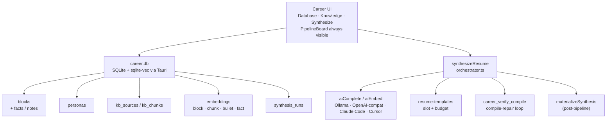
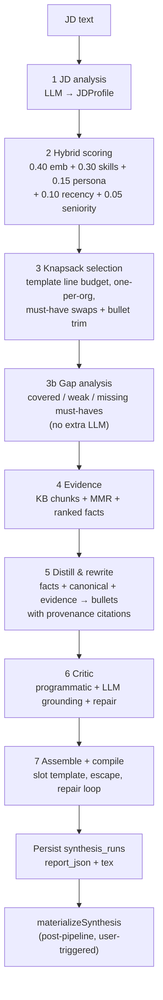

# Career Platform — System Design & Feature Spec

Authoritative design document for DevPrism’s **Master Career Database** and **JD-driven Resume Synthesis** (v2). Grounded in the working tree as of this writing; remaining gap-closing work is marked **Planned** and must not be confused with shipped APIs.

**Related docs**

- Pipeline-focused companion: [`RESUME_SYNTHESIS.md`](./RESUME_SYNTHESIS.md)
- Repo map: [`DEV_MAP.md`](./DEV_MAP.md)

**Entry points**

- Project Picker → Career
- Workspace → Command palette (“Open Career database”) or sidebar Career control
- Space quick action “Synthesize resume” (exposed beyond resume-kind spaces)

**Tabs:** Database · Knowledge · Synthesize  
`openCareer()` remembers the last active tab; an optional tab argument forces Database / Knowledge / Synthesize.

---

## Architecture overview



| Layer | Responsibility | Canonical paths |
|-------|----------------|-----------------|
| **1 — Data schema & ingestion** | Document-store SQLite; Fact Pool; KB + resume / quick-points ingest; SHA-1 content hashing | `career/types.ts`, `career/distill-facts.ts`, `career/ingest/`, `career_db/schema.rs` |
| **2 — Context integration** | Chunk → embed → ANN (sqlite-vec) with cosine fallback; deferred embed + backfill; fact embeddings | `career/ingest/embed.ts`, `block-embed.ts`, `career_db/vectors.rs` |
| **3 — RAG / inference** | Seven-stage `synthesizeResume` (+ stage 3b gap analysis) → optional workspace materialize | `resume-synthesis/`, `resume-templates/` |

---

## 1. Data Schema & Ingestion

### 1.1 Storage location and pattern

- **DB path:** `~/Library/Application Support/DevPrism/career.db` on macOS (Tauri app-data dir on other platforms).
- **Pattern:** Document store — full JSON in `json` / `meta_json` / `report_json`, with denormalized index columns for queries.
- **Host:** `apps/desktop/src-tauri/src/career_db/` (`schema.rs`, `mod.rs`, `vectors.rs`, `ingest.rs`).
- **Client types:** `apps/desktop/src/lib/career/types.ts` (mirrored by Rust serde structs). Old block rows parse with `#[serde(default)]` for new fields (`facts`, `notes`) — no SQL migration for the Fact Pool.

### 1.2 SQL layout

Defined in `career_db/schema.rs` (`SCHEMA_SQL`):

| Table | Role |
|-------|------|
| `blocks` | Experience / project / publication / education / leadership (`ExperienceBlock` JSON, including `facts[]` / `notes`) |
| `personas` | Targeting profiles (`ai`, `life-sciences`, `management` seeded) |
| `kb_sources` | Ingested knowledge-base documents |
| `kb_chunks` | Heading-aware text chunks + `meta_json` |
| `embeddings` | f32 little-endian BLOB vectors; PK `(owner_id, model)`; `owner_kind`: `block` \| `chunk` \| `bullet` \| `fact` |
| `vec_embeddings` | sqlite-vec virtual table (ANN index); rebuilt from `embeddings` SoT when needed |
| `synthesis_runs` | JD hash + persona + template + match report (+ optional `.tex`) |

```sql
-- Simplified from SCHEMA_SQL (current)
CREATE TABLE blocks (
    id TEXT PRIMARY KEY,
    kind TEXT,
    json TEXT NOT NULL,
    updated_at INTEGER
);
CREATE TABLE personas (
    id TEXT PRIMARY KEY,
    json TEXT NOT NULL
);
CREATE TABLE kb_sources (
    id TEXT PRIMARY KEY,
    source_type TEXT,
    uri TEXT,
    title TEXT,
    content_hash TEXT,
    ingested_at INTEGER
);
CREATE TABLE kb_chunks (
    id TEXT PRIMARY KEY,
    source_id TEXT REFERENCES kb_sources(id),
    text TEXT,
    meta_json TEXT
);
CREATE TABLE embeddings (
    owner_id TEXT NOT NULL,
    owner_kind TEXT,
    model TEXT NOT NULL,
    dim INTEGER,
    vec BLOB,
    PRIMARY KEY (owner_id, model)
);
CREATE TABLE synthesis_runs (
    id TEXT PRIMARY KEY,
    jd_hash TEXT,
    persona_id TEXT,
    template_id TEXT,
    report_json TEXT,
    created_at INTEGER
);
```

Indexes today: `idx_embeddings_owner_kind`, `idx_kb_chunks_source_id`, `idx_blocks_kind`.  
Migration: existing DBs upgrade `embeddings` from `PRIMARY KEY (owner_id)` → `(owner_id, model)` idempotently in `schema.rs`.

### 1.3 ExperienceBlock

| Field | Type / notes |
|-------|----------------|
| `id` | Stable string id |
| `kind` | `experience` \| `project` \| `publication` \| `education` \| `leadership` |
| `title`, `org` | Display / org-dedup in knapsack |
| `dateRange` | `{ start, end }` — ISO-ish; `end: null` = present |
| `personas[]` | Persona ids this block targets |
| `domains[]` | Domain tags for filter + skill coverage |
| `skills[{name, level 1–5, years?}]` | Tag scoring |
| `seniorityLevel` | `ic` \| `senior` \| `lead` \| `manager` \| `director` |
| `bullets[]` | See below |
| `facts[]` | **Fact Pool** — raw ground-truth points for distillation (see §1.5) |
| `notes?` | Free-form scratchpad; input for “Distill with AI” |
| `embeddingText?` | Computed: title + org + domains + canonical bullets + **fact texts** |
| `updatedAt` | ISO timestamp |

### 1.4 Bullet

| Field | Behavior |
|-------|----------|
| `id` | Stable within block |
| `canonical` | Ground-truth phrasing; source of factual claims |
| `variants` | Optional per-persona spins (`Partial<Record<PersonaId, string>>`) |
| `metrics[]` | `{ value, kind }` — `value` **must** survive rewrites verbatim |
| `evidenceRefs[]` | KB chunk ids grounding the claim |
| `locked` | Selectable but never re-phrased by AI |

### 1.5 BlockFact (Fact Pool)

Raw detail points stored on each block so synthesis can distill JD-tailored bullets without inventing claims.

| Field | Type / notes |
|-------|----------------|
| `id` | Stable id (`fct_…`) |
| `text` | One raw detail point (ground truth) |
| `skills[]` | Optional skill tags for must-have targeting |
| `metrics[]` | Values that must survive verbatim when distilled |
| `source` | `manual` \| `distilled` \| `import` |
| `createdAt` | ISO timestamp |

**Ingestion paths**

| Path | Behavior |
|------|----------|
| Block editor | “Knowledge / raw points” — manual add; paste notes + **Distill with AI** (`distillFactsFromNotes` → `aiComplete` JSON) with preview before save |
| Add-knowledge dialog | **Quick points** mode — paste N points, pick/create target block, AI structures into `BlockFact[]` with preview before commit; document ingest (md/pdf/opml/bibtex) unchanged |
| Resume import wizard | Extraction may emit facts when the source has more detail than fits in bullets (`source: "import"`) |

Helpers: `newBlockFact` / `computeEmbeddingText` in `block-helpers.ts`; LLM structuring in `distill-facts.ts`.

### 1.6 Persona (multi-persona model)

Seeded once via `INSERT OR IGNORE` in `seed_default_personas` — user edits are never overwritten on reopen.

| Id | Focus | Default `sectionOrder` |
|----|--------|-------------------------|
| `ai` | ML / systems / measurable model outcomes | experience → projects → skills → education → publications |
| `life-sciences` | Scientific rigor, assays, pipelines | experience → publications → projects → skills → education |
| `management` | Scope, teams, stakeholder delivery | experience → leadership → skills → projects → education → publications |

Each persona stores:

- `skillWeights: Record<string, number>` — boosts skill-overlap hits during hybrid scoring
- `toneDirective` — injected into rewrite / critic prompts
- `sectionOrder: SectionKind[]` — assembly order
- `defaultTemplateId` — usually `ats-single-column` (UI may override from the template registry)

### 1.7 Chunking policy

Implemented in `career/ingest/chunking.ts`:

| Constant | Value |
|----------|-------|
| Token heuristic | ~4 chars/token |
| Window | **200–400 tokens** (800–1600 chars) |
| Overlap | **15%** within a heading path (min 40 chars) |
| Cross-heading | **Never merges** across different `headingPath`s |
| Chunk text | `headingPath.join(" > ")` + blank line + body when headings exist |

Per-chunk `meta.contentHash` = SHA-1 of chunk text (`sha1HexSync` in `ingest/hash.ts`). Source-level `contentHash` is SHA-1 of the document (or concatenated chunk hashes) for incremental re-ingest.

### 1.8 Content-hash dedup & ingest pipeline

Pipeline: `ingest/pipeline.ts` — parse → chunk → hash → `career_upsert_kb_source` → embed (with `ProcessingProgress` callbacks).

| Source | Adapter | Notes |
|--------|---------|--------|
| Markdown / Obsidian | `ingest/markdown.ts` | Heading-aware sections |
| PDF | `ingest/pdf.ts` | MuPDF text extraction |
| OPML / FreeMind | `ingest/mindmap.ts` | Outline → sections |
| BibTeX / Zotero | `ingest/zotero.ts` | One KB chunk per BibTeX entry (`sourceType: "publication"`) |
| BibTeX → blocks | `publication-import-wizard.tsx` | Preview + commit `kind: "publication"` `ExperienceBlock`s |
| Pasted / wizard resume | `extract-resume.ts` | LLM extraction → draft blocks (+ optional facts) |
| Quick points | `add-knowledge-dialog.tsx` + `distill-facts.ts` | Paste → structured facts on a block |

**Dedup behavior (exists today):**

- Unchanged source `contentHash` → upsert may skip re-chunking (`IngestReport.skipped`).
- Chunks whose text hash is unchanged can reuse embeddings; `needsEmbedding` lists chunk ids that still need vectors.
- Embed failures **defer** (`EmbedPipelineResult.deferred`) — chunks/blocks stay stored; backfill via `backfillKbEmbeddings` / `backfillBlockEmbeddings` / `backfillBulletEmbeddings` / `backfillFactEmbeddings`.

**Unified progress type** (`ProcessingProgress`): phases `parse` \| `chunk` \| `hash` \| `upsert` \| `embed` \| `done` \| `error`. Progress is frontend-driven; Rust career commands are request/response only.

---

## 2. Context Integration

### 2.1 Vector store (current)

- **Table:** `embeddings` — composite PK `(owner_id, model)`, `owner_kind`, `dim`, `vec` (f32 LE BLOB).
- **ANN index:** `vec_embeddings` (sqlite-vec vec0); populated alongside store writes; rebuilt lazily if dim/model changes.
- **Search:** Prefer KNN `MATCH` with over-fetch + post-filter for persona/domain/kind; **brute-force cosine fallback** if the extension fails to load (`career_db/vectors.rs`).
- **Write path:** TS `aiEmbed` → Tauri `ai_embed` → `career_store_embeddings`.
- **Default local model:** Ollama `nomic-embed-text`.
- **Cloud:** Gemini / OpenAI embeddings when the OpenAI-compat credential supports them (Groq does not embed).
- **Filters:** `ownerKind`, plus `personas` / `domains` / `kinds` (applied when resolving block JSON for `owner_kind == "block"`).
- Mixed-dimension / wrong-model rows are **skipped** at query time (search is scoped to one model; dim must match query).

### 2.2 Owner kinds

| `ownerKind` | When written | Used by synthesis |
|-------------|--------------|-------------------|
| `chunk` | KB ingest / `backfillKbEmbeddings` | Stage 4 evidence retrieval |
| `block` | Block save / “Embed all blocks” / backfill | Stage 2 hybrid scoring |
| `bullet` | Block save / `backfillBulletEmbeddings` | Stage 3 bullet trim relevance |
| `fact` | Block save / `backfillFactEmbeddings` | Stage 4 fact ranking → stage 5 distill |

### 2.3 Hit text resolution

`resolve_hit_text` in `vectors.rs`:

- `chunk` → chunk text + `meta_json`
- `block` → `embeddingText` (or title+org) + full block JSON as meta
- `bullet` → bullet `canonical` + parent block meta
- `fact` → fact `text` + parent block meta (includes fact id / block id)

`career_delete_block` removes the block row **and** child bullet + fact embedding rows.

### 2.4 Deferred embedding + backfill

| Path | On embed failure |
|------|------------------|
| KB ingest | Chunks stored; `deferred: true`; call `backfillKbEmbeddings()` |
| Block save | Block stored; `deferred: true`; call `backfillBlockEmbeddings()` / `backfillBulletEmbeddings()` / `backfillFactEmbeddings()` |
| Synthesis | JD facet embed failure → `JdFacets.semanticMatchingDisabled`; tag-only scoring |

### 2.5 Source adapters (summary)

| Adapter | Input | Output |
|---------|-------|--------|
| Wiki / markdown | `.md` / paste | Heading sections → chunks |
| PDF | File bytes via MuPDF | Page-aware text → chunks |
| Mind map | OPML / FreeMind XML | Outline sections → chunks |
| BibTeX (KB) | Zotero export / paste | One chunk per entry |
| BibTeX (blocks) | Publication import wizard | `kind: "publication"` blocks + embeddings |
| Resume wizard | Paste / PDF | LLM → draft blocks (+ facts when detail-rich) |
| Quick points | Paste in Synthesize dialog | AI → `BlockFact[]` on target block |

---

## 3. AI Selection & Inference Pipeline

Orchestrator: `apps/desktop/src/lib/resume-synthesis/orchestrator.ts`.  
Structured LLM: `llmJson` → `aiComplete` (JSON mode, salvage-parse + one reprompt).  
Distill/rewrite prefers `aiCompleteStream` with `llmJson` fallback.



### 3.1 Stage table

| Stage | Module | Typical LLM / embed | Output |
|-------|--------|---------------------|--------|
| 1 JD analysis | `jd-analysis.ts` | 1× `llmJson` (stream preview when available) | Must/nice skills, domains, ATS keywords, tone, facet texts |
| 2 Hybrid score | `scoring.ts` | 1× `aiEmbed` (3 JD facets) + block vector search | Explainable component scores |
| 3 Knapsack | `selection.ts` | Optional bullet vector search | Selected set under `ResumeTemplateBudget` |
| 3b Gap analysis | `gap-analysis.ts` | None (pure TS) | `MatchReport.gapAnalysis` — covered / weak / missing + suggestions |
| 4 Evidence | orchestrator + MMR | Per-block chunk search + embed for MMR; fact ranking (cosine + must-have boost) | ≤3 grounding snippets / block; top-k ranked facts → `blockFacts` |
| 5 Distill & rewrite | `rewrite.ts` | 1× stream/`llmJson` per selected block | Plain-text bullets with `sourceFactIds` / `sourceBulletId` |
| 6 Critic | `critic.ts` | 1× critic + ≤2 repair rounds (stream preview when available) | Grounding / ATS coverage; provenance checks |
| 7 Assemble | templates + `compile-verify.ts` | Compile loop (no LLM) | Escaped `.tex` + PDF when engine succeeds |

**Post-pipeline:** `materializeSynthesis` writes `.tex` into a variant or new project. Rematerialization of a stored run reuses persisted `tex` without re-running LLM stages.

### 3.2 Prompting per stage

#### Stage 1 — `JD_SYSTEM` (`jd-analysis.ts`)

JSON contract only:

```json
{
  "roleTitle": "string",
  "seniority": "ic|senior|lead|manager|director",
  "mustHaveSkills": ["string"],
  "niceToHaveSkills": ["string"],
  "domains": ["string"],
  "atsKeywords": ["string"],
  "toneSignals": ["string"],
  "responsibilitiesText": "string",
  "qualificationsText": "string"
}
```

Facets for embedding: full JD text, `responsibilitiesText`, `qualificationsText` (`facetsOf`).

#### Stage 3b — Gap analysis (`gap-analysis.ts`)

Pure TypeScript (no LLM). For each `mustHaveSkill`, classify **covered** / **weak** / **missing** across:

- selected blocks (skills, domains, bullets, facts)
- full pool (non-selected blocks)
- optional KB chunk text

Uses `skillsMatch` / `textCoversSkill` from `scoring.ts`. Stored on `MatchReport.gapAnalysis` (`items`, `summary`, counts). UI: “What’s missing” panel with actionable suggestions (e.g. add a fact about a skill to a block).

#### Stage 5 — Distill & rewrite (`rewrite.ts`)

- Input per block: canonical bullets + top-ranked facts + KB evidence + JD profile + persona tone + per-bullet budget.
- Return `{"bullets":[{"id","text","sourceFactIds","sourceBulletId"}]}` only.
- Every bullet must cite provenance (`sourceFactIds` and/or `sourceBulletId`). May distill a bullet **from facts alone** (`sourceBulletId` null) up to the trim cap.
- Plain text — no LaTeX, no backslashes, no `{` `}` (enforced by `hasForbiddenLatex`).
- Preserve every cited `metric.value` verbatim; invalid provenance / metrics → fall back to canonical (or drop fact-only bullets).
- Locked bullets copied exactly; character budget from template `perBullet`.
- Persona `toneDirective` + JD tone / ATS keywords in the user prompt.
- `MatchReport` gains `bulletProvenance`, `blockFacts`, optional `blockDiffs`.

#### Stage 6 — `CRITIC_SYSTEM` (`critic.ts`)

- Return `atsCoveragePct` + per-bullet `verdicts` (`grounded`, `keywordHits`, `flags`).
- Programmatic invariants run first (metrics, LaTeX smuggling, provenance ids); LLM judges grounding.
- Flagged bullets repaired (≤2 rounds) or reverted to canonical; fact-only distill bullets skip creative LLM repair when provenance is intact.

### 3.3 Hybrid scoring formula

From `scoring.ts` (`DEFAULT_WEIGHTS`):

\[
\text{score} = 0.40\cdot e + 0.30\cdot s + 0.15\cdot p + 0.10\cdot r + 0.05\cdot n
\]

| Component | Meaning |
|-----------|---------|
| \(e\) | Max cosine over JD facets vs block embedding (clamped \[0,1\]) |
| \(s\) | Skill overlap (must-have counts 2×; persona `skillWeights` boost) |
| \(p\) | Persona affinity (block tagged with active persona → 1) |
| \(r\) | Recency decay (half-life ~4 years from end/start date) |
| \(n\) | Seniority fit vs JD seniority |

Block `embeddingText` includes fact texts, so hybrid scoring benefits from the Fact Pool without formula changes.

**Degradation:** If facet embedding fails or returns empty vectors, `semanticMatchingDisabled = true`, embedding weight → 0, remaining weights **renormalized**. Evidence / fact cosine ranking degrades to keyword boosts; distill still runs on canonical + facts + JD context. UI banner via match-report notices.

### 3.4 Knapsack & bullet trim

`selection.ts`:

1. Sort scored blocks; greedy take while `totalLines` and per-section caps allow.
2. Prefer ≤1 block per `org` unless challenger clears a score gap.
3. Must-have coverage swaps (add/swap blocks that cover uncovered skills).
4. `trimSelectedBullets` — keep up to `DEFAULT_MAX_BULLETS_PER_BLOCK` (4), ranked by bullet embedding relevance + must-have coverage; locked / metric-rich bullets preferred.

Template budgets (examples):

| Template | `totalLines` | `perBullet` |
|----------|--------------|-------------|
| `ats-single-column` | 55 | 140 |
| `ats-two-column` | (see template) | 120 |

### 3.5 Evidence + fact ranking (stage 4)

- **KB:** Vector search `ownerKind: "chunk"`, boost hits mentioning block title/org; MMR select top 3 (`λ ≈ 0.7`) when re-embed of candidates succeeds; else prefix-dedup fallback.
- **Facts:** Rank the selected block’s `facts[]` by JD-facet cosine (`ownerKind: "fact"`) + must-have keyword/skill boost; top-k feed stage 5. Stored on `MatchReport.blockFacts`.

### 3.6 LaTeX safety

| Guard | Behavior |
|-------|----------|
| AI plain text only | Rewrite/critic reject `\\command` and raw `{` `}` |
| Slot escape | `escapeAndValidateSlot` — escape then validate; fall back to canonical |
| Preamble lock | Template `preamble` concatenated as-is; models never see or edit it |
| Compile repair | `compileWithRepairLoop` maps engine line → slot, reverts culprit slots to canonical plain text, re-escapes; never mutates preamble/scaffolding |
| Soft-fail path | Exhausted compile retries yield `compileOk: false` + orchestrator `done` with detail “Compile needs review” (reviewable tex), not a thrown hard error |

### 3.7 Progress, cancellation & Synthesize UX

**PipelineBoard** (`synthesize/pipeline-board.tsx`) — always visible on the Synthesize tab:

| State | Behavior |
|-------|----------|
| Idle | Seven stages with one-line descriptions (“what will happen”) |
| Blocked | Run-blocked explainer checklist (JD length / blocks / AI readiness / persona / template) with fix CTAs — no silently disabled Run |
| Running | Live stage highlighting, elapsed, stream preview, per-block rewrite checklist (`RunProgressView`) |
| Done / error / cancelled | Timings + outcome badges; stored-run view supported |

**Readiness**

- `AiReadinessCard` never returns null — skeleton while probing (`preflight.ts` / synthesis readiness).
- `KnowledgePanel` shows a loading state instead of a false “0 sources”.
- Embeddings optional / degraded when semantic matching is disabled.

**Results**

- Per-block before/after diff cards (canonical vs tailored) with fact/evidence provenance chips.
- “What’s missing” panel from `gapAnalysis`.
- Auto-open the most recent stored run when the tab is idle so history is visible immediately.

**Cancellation**

- `AbortSignal` on `synthesizeResume`; `throwIfAborted` between stages and inside rewrite loops.
- `aiComplete` / `aiCompleteStream` / `llmJson` honor AbortSignal mid-request via `requestId` + Tauri `ai_cancel_request`.
- `synthesis-store.cancel()` aborts the controller; UI Cancel while `running`.
- Terminal stages: `done` / `error` / `cancelled`.
- Live stream preview for JD analysis, distill/rewrite, and critic when the provider streams; CLI backends show a waiting panel with clearer “provider does not stream — heartbeat” copy when applicable.

### 3.8 LLM provider routing (current)

`resolveAiProvider` in `ai-assist.ts`:

- Honors OpenAI-compat credentials when selected.
- Honors Claude Code and Cursor CLI providers for one-shot / stream completion (JD analysis, distill, critic).
- Embeddings stay on Ollama/cloud regardless of chat provider (neither CLI embeds); tag-only degradation banner when embed fails.

---

## 4. Shipped gap workstreams (reference)

The following were previously **Planned** in this doc and are now **shipped**. Acceptance checkboxes are kept for audit.

### Workstream 1 — sqlite-vec ANN search — shipped

- sqlite-vec registered on connection open; `vec_embeddings` alongside `embeddings` SoT.
- KNN with over-fetch + post-filter; brute-force cosine fallback if extension fails.
- Extension load failure does not break career DB open.

### Workstream 2 — Claude Code / Cursor as synthesis backends — shipped

- One-shot / stream via `resolveAiProvider` → `ai_complete` / `ai_complete_stream`.
- Embeddings remain Ollama/cloud; `semanticMatchingDisabled` on embed failure.

### Workstream 3 — Mid-request cancellation + richer progress — shipped

- Cancel registry + `ai_cancel_request`; AbortSignal honored in `aiComplete` / `aiCompleteStream` / `llmJson`.
- Stream previews for JD analysis and critic; rewrite checklist + PipelineBoard.
- Compile soft-fail surfaces as reviewable `done` with `compileOk: false`.

### Workstream 4 — BibTeX → publication blocks — shipped

- `publication-import-wizard.tsx` preview + commit `kind: "publication"` blocks.
- KB-only BibTeX ingest remains available on the Knowledge tab.

### Workstream 5 — Embedding data hygiene — shipped

- Delete block removes block + bullet + **fact** embedding rows.
- `resolve_hit_text` returns text for `bullet` and `fact`.
- PK `(owner_id, model)`; search scoped per model.

### Workstream 6 — Career UI component tests — shipped

- Component tests under `apps/desktop/src/__tests__/components/career/` (CareerView, Synthesize tab, PipelineBoard, BlockEditor, import wizards).

### v2 Fact Pool / distill / gap / PipelineBoard — shipped

Covered in §§1.5, 2.2–2.4, 3.1–3.2, 3.5, 3.7 above. Tests include distill validation, gap analysis, fact embed backfill, PipelineBoard / blocked-explainer, and Rust fact owner-kind cleanup.

---

## 5. Known invariants

1. AI emits **plain text only** into slots; LaTeX is produced solely by escape + audited macros.
2. Compile-verify may only mutate **slot content**, never the preamble or column scaffolding.
3. Knapsack respects template budget and prefers ≤1 block per org (unless a challenger clears the score gap).
4. Embedding failures must not abort synthesis — degrade via `semanticMatchingDisabled`.
5. Persona seed is insert-once; user persona JSON is authoritative after first edit.
6. `synthesis_runs` store the match report (+ tex when available) for audit; blocks remain the source of truth.
7. `materializeSynthesis` is user-triggered and post-pipeline — not part of the seven stages.
8. Distilled bullets must cite existing fact/bullet ids; metrics from cited provenance survive verbatim or the bullet falls back / is dropped.
9. Do not invent Tauri commands or HTTP endpoints in docs or code beyond what exists in the working tree.

---

## 6. Key source paths

| Area | Path |
|------|------|
| Career UI | `apps/desktop/src/components/career/` |
| Synthesize UX | `apps/desktop/src/components/career/synthesize/` (`PipelineBoard`, `AiReadinessCard`, `AddKnowledgeDialog`, results / gap panel) |
| Career client + types | `apps/desktop/src/lib/career/` |
| Fact distill (ingest) | `apps/desktop/src/lib/career/distill-facts.ts` |
| KB ingest | `apps/desktop/src/lib/career/ingest/` |
| Block/bullet/fact embeddings | `apps/desktop/src/lib/career/block-embed.ts` |
| Synthesis pipeline | `apps/desktop/src/lib/resume-synthesis/` |
| Gap analysis | `apps/desktop/src/lib/resume-synthesis/gap-analysis.ts` |
| Templates | `apps/desktop/src/lib/resume-templates/` |
| Career SQLite host | `apps/desktop/src-tauri/src/career_db/` |
| Compile verify | `apps/desktop/src-tauri/src/career_compile.rs` |
| Progress UI store | `apps/desktop/src/stores/synthesis-store.ts` |
| Career tab memory | `apps/desktop/src/stores/career-store.ts` (`openCareer`) |
| AI assist routing | `apps/desktop/src/lib/ai-assist.ts` |

---

## 7. Out of scope (unless promoted by a new design revision)

- Rust-side progress event streams (progress stays TS-orchestrated).
- Changing hybrid weight defaults without a separate design revision.
- Cloud-hosted career DB or multi-user sync.
