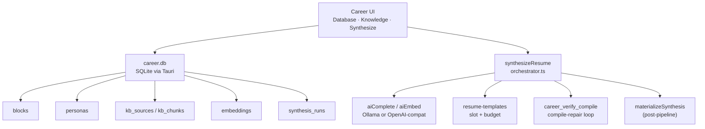
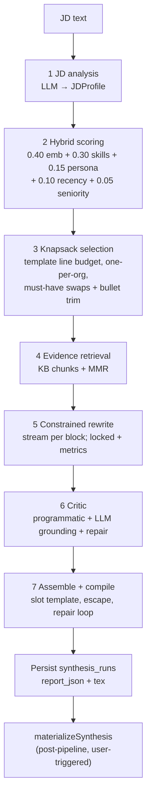

# Career Platform — System Design & Feature Spec

Authoritative design document for DevPrism’s **Master Career Database** and **JD-driven Resume Synthesis**. Grounded in the working tree as of this writing; planned gap-closing refactors are marked **Planned** and must not be confused with shipped APIs.

**Related docs**

- Pipeline-focused companion: [`RESUME_SYNTHESIS.md`](./RESUME_SYNTHESIS.md)
- Repo map: [`GITNEXUS_MAP.md`](./GITNEXUS_MAP.md)

**Entry points**

- Project Picker → Career
- Workspace → Command palette (“Open Career database”) or sidebar Career control

**Tabs:** Database · Knowledge · Synthesize

---

## Architecture overview



| Layer | Responsibility | Canonical paths |
|-------|----------------|-----------------|
| **1 — Data schema & ingestion** | Document-store SQLite; KB + resume ingest; SHA-1 content hashing | `career/types.ts`, `career/ingest/`, `career_db/schema.rs` |
| **2 — Context integration** | Chunk → embed → cosine search; deferred embed + backfill | `career/ingest/embed.ts`, `block-embed.ts`, `career_db/vectors.rs` |
| **3 — RAG / inference** | Seven-stage `synthesizeResume` → optional workspace materialize | `resume-synthesis/`, `resume-templates/` |

---

## 1. Data Schema & Ingestion

### 1.1 Storage location and pattern

- **DB path:** `~/Library/Application Support/DevPrism/career.db` on macOS (Tauri app-data dir on other platforms).
- **Pattern:** Document store — full JSON in `json` / `meta_json` / `report_json`, with denormalized index columns for queries.
- **Host:** `apps/desktop/src-tauri/src/career_db/` (`schema.rs`, `mod.rs`, `vectors.rs`, `ingest.rs`).
- **Client types:** `apps/desktop/src/lib/career/types.ts` (mirrored by Rust serde structs).

### 1.2 SQL layout

Defined in `career_db/schema.rs` (`SCHEMA_SQL`):

| Table | Role |
|-------|------|
| `blocks` | Experience / project / publication / education / leadership (`ExperienceBlock` JSON) |
| `personas` | Targeting profiles (`ai`, `life-sciences`, `management` seeded) |
| `kb_sources` | Ingested knowledge-base documents |
| `kb_chunks` | Heading-aware text chunks + `meta_json` |
| `embeddings` | f32 little-endian BLOB vectors (`owner_kind`: `block` \| `chunk` \| `bullet`) |
| `synthesis_runs` | JD hash + persona + template + match report (+ optional `.tex`) |

```sql
-- Simplified from SCHEMA_SQL
CREATE TABLE blocks (
    id TEXT PRIMARY KEY,
    kind TEXT,
    json TEXT NOT NULL,
    updated_at INTEGER
);
CREATE TABLE personas (
    id TEXT PRIMARY KEY,
    json TEXT NOT NULL
);
CREATE TABLE kb_sources (
    id TEXT PRIMARY KEY,
    source_type TEXT,
    uri TEXT,
    title TEXT,
    content_hash TEXT,
    ingested_at INTEGER
);
CREATE TABLE kb_chunks (
    id TEXT PRIMARY KEY,
    source_id TEXT REFERENCES kb_sources(id),
    text TEXT,
    meta_json TEXT
);
CREATE TABLE embeddings (
    owner_id TEXT PRIMARY KEY,   -- see Planned: (owner_id, model)
    owner_kind TEXT,
    model TEXT,
    dim INTEGER,
    vec BLOB
);
CREATE TABLE synthesis_runs (
    id TEXT PRIMARY KEY,
    jd_hash TEXT,
    persona_id TEXT,
    template_id TEXT,
    report_json TEXT,
    created_at INTEGER
);
```

Indexes today: `idx_embeddings_owner_kind`, `idx_kb_chunks_source_id`, `idx_blocks_kind`.

### 1.3 ExperienceBlock

| Field | Type / notes |
|-------|----------------|
| `id` | Stable string id |
| `kind` | `experience` \| `project` \| `publication` \| `education` \| `leadership` |
| `title`, `org` | Display / org-dedup in knapsack |
| `dateRange` | `{ start, end }` — ISO-ish; `end: null` = present |
| `personas[]` | Persona ids this block targets |
| `domains[]` | Domain tags for filter + skill coverage |
| `skills[{name, level 1–5, years?}]` | Tag scoring |
| `seniorityLevel` | `ic` \| `senior` \| `lead` \| `manager` \| `director` |
| `bullets[]` | See below |
| `embeddingText?` | Computed: title + org + domains + canonical bullets |
| `updatedAt` | ISO timestamp |

### 1.4 Bullet

| Field | Behavior |
|-------|----------|
| `id` | Stable within block |
| `canonical` | Ground-truth phrasing; source of factual claims |
| `variants` | Optional per-persona spins (`Partial<Record<PersonaId, string>>`) |
| `metrics[]` | `{ value, kind }` — `value` **must** survive rewrites verbatim |
| `evidenceRefs[]` | KB chunk ids grounding the claim |
| `locked` | Selectable but never re-phrased by AI |

### 1.5 Persona (multi-persona model)

Seeded once via `INSERT OR IGNORE` in `seed_default_personas` — user edits are never overwritten on reopen.

| Id | Focus | Default `sectionOrder` |
|----|--------|-------------------------|
| `ai` | ML / systems / measurable model outcomes | experience → projects → skills → education → publications |
| `life-sciences` | Scientific rigor, assays, pipelines | experience → publications → projects → skills → education |
| `management` | Scope, teams, stakeholder delivery | experience → leadership → skills → projects → education → publications |

Each persona stores:

- `skillWeights: Record<string, number>` — boosts skill-overlap hits during hybrid scoring
- `toneDirective` — injected into rewrite / critic prompts
- `sectionOrder: SectionKind[]` — assembly order
- `defaultTemplateId` — usually `ats-single-column` (UI may override from the template registry)

### 1.6 Chunking policy

Implemented in `career/ingest/chunking.ts`:

| Constant | Value |
|----------|-------|
| Token heuristic | ~4 chars/token |
| Window | **200–400 tokens** (800–1600 chars) |
| Overlap | **15%** within a heading path (min 40 chars) |
| Cross-heading | **Never merges** across different `headingPath`s |
| Chunk text | `headingPath.join(" > ")` + blank line + body when headings exist |

Per-chunk `meta.contentHash` = SHA-1 of chunk text (`sha1HexSync` in `ingest/hash.ts`). Source-level `contentHash` is SHA-1 of the document (or concatenated chunk hashes) for incremental re-ingest.

### 1.7 Content-hash dedup & ingest pipeline

Pipeline: `ingest/pipeline.ts` — parse → chunk → hash → `career_upsert_kb_source` → embed (with `ProcessingProgress` callbacks).

| Source | Adapter | Notes |
|--------|---------|--------|
| Markdown / Obsidian | `ingest/markdown.ts` | Heading-aware sections |
| PDF | `ingest/pdf.ts` | MuPDF text extraction |
| OPML / FreeMind | `ingest/mindmap.ts` | Outline → sections |
| BibTeX / Zotero | `ingest/zotero.ts` | One KB chunk per BibTeX entry (`sourceType: "publication"`) |
| Pasted / wizard resume | `extract-resume.ts` | LLM extraction → draft `ExperienceBlock`s |

**Dedup behavior (exists today):**

- Unchanged source `contentHash` → upsert may skip re-chunking (`IngestReport.skipped`).
- Chunks whose text hash is unchanged can reuse embeddings; `needsEmbedding` lists chunk ids that still need vectors.
- Embed failures **defer** (`EmbedPipelineResult.deferred`) — chunks/blocks stay stored; backfill via `backfillKbEmbeddings` / `backfillBlockEmbeddings` / `backfillBulletEmbeddings`.

**Unified progress type** (`ProcessingProgress`): phases `parse` \| `chunk` \| `hash` \| `upsert` \| `embed` \| `done` \| `error`. Progress is frontend-driven; Rust career commands are request/response only.

---

## 2. Context Integration

### 2.1 Vector store (current)

- **Table:** `embeddings` — `owner_id` PK, `owner_kind`, `model`, `dim`, `vec` (f32 LE BLOB).
- **Write path:** TS `aiEmbed` → Tauri `ai_embed` → `career_store_embeddings`.
- **Default local model:** Ollama `nomic-embed-text`.
- **Cloud:** Gemini / OpenAI embeddings when the OpenAI-compat credential supports them (Groq does not embed).
- **Search:** Brute-force cosine in `career_db/vectors.rs` (`vector_search`), with optional filters:
  - `ownerKind`
  - `personas` / `domains` / `kinds` (applied only when `owner_kind == "block"` by loading block JSON)
- Mixed-dimension rows (wrong model) are **skipped** at query time (dim must match query).

### 2.2 Owner kinds

| `ownerKind` | When written | Used by synthesis |
|-------------|--------------|-------------------|
| `chunk` | KB ingest / `backfillKbEmbeddings` | Stage 4 evidence retrieval |
| `block` | Block save / “Embed all blocks” / backfill | Stage 2 hybrid scoring |
| `bullet` | Block save / `backfillBulletEmbeddings` | Stage 3 bullet trim relevance |

### 2.3 Hit text resolution (current gaps)

`resolve_hit_text` in `vectors.rs`:

- `chunk` → chunk text + `meta_json`
- `block` → `embeddingText` (or title+org) + full block JSON as meta
- **other (including `bullet`)** → empty text + null meta (**Planned** fix in Workstream 5)

### 2.4 Deferred embedding + backfill

| Path | On embed failure |
|------|------------------|
| KB ingest | Chunks stored; `deferred: true`; call `backfillKbEmbeddings()` |
| Block save | Block stored; `deferred: true`; call `backfillBlockEmbeddings()` / `backfillBulletEmbeddings()` |
| Synthesis | JD facet embed failure → `JdFacets.semanticMatchingDisabled`; tag-only scoring |

### 2.5 Source adapters (summary)

| Adapter | Input | Output |
|---------|-------|--------|
| Wiki / markdown | `.md` / paste | Heading sections → chunks |
| PDF | File bytes via MuPDF | Page-aware text → chunks |
| Mind map | OPML / FreeMind XML | Outline sections → chunks |
| BibTeX | Zotero export / paste | One chunk per entry (KB only today) |
| Resume wizard | Paste / PDF | LLM → draft blocks (Database tab) |

**Note:** Knowledge-tab BibTeX ingest already calls `seedPublicationsFromBibtex` and writes **KB chunks**. It does **not** create `ExperienceBlock` rows with `kind: "publication"`. That block-level import is **Planned** (Workstream 4).

---

## 3. AI Selection & Inference Pipeline

Orchestrator: `apps/desktop/src/lib/resume-synthesis/orchestrator.ts`.  
Structured LLM: `llmJson` → `aiComplete` (JSON mode, salvage-parse + one reprompt).  
Rewrite prefers `aiCompleteStream` with `llmJson` fallback.



### 3.1 Stage table

| Stage | Module | Typical LLM / embed | Output |
|-------|--------|---------------------|--------|
| 1 JD analysis | `jd-analysis.ts` | 1× `llmJson` | Must/nice skills, domains, ATS keywords, tone, facet texts |
| 2 Hybrid score | `scoring.ts` | 1× `aiEmbed` (3 JD facets) + block vector search | Explainable component scores |
| 3 Knapsack | `selection.ts` | Optional bullet vector search | Selected set under `ResumeTemplateBudget` |
| 4 Evidence | orchestrator + MMR | Per-block chunk search + embed for MMR | ≤3 grounding snippets / block |
| 5 Rewrite | `rewrite.ts` | 1× stream/`llmJson` per selected block | Plain-text bullets only |
| 6 Critic | `critic.ts` | 1× critic + ≤2 repair rounds | Grounding / ATS coverage |
| 7 Assemble | templates + `compile-verify.ts` | Compile loop (no LLM) | Escaped `.tex` + PDF when engine succeeds |

**Post-pipeline:** `materializeSynthesis` writes `.tex` into a variant or new project. Rematerialization of a stored run reuses persisted `tex` without re-running LLM stages.

### 3.2 Prompting per stage

#### Stage 1 — `JD_SYSTEM` (`jd-analysis.ts`)

JSON contract only:

```json
{
  "roleTitle": "string",
  "seniority": "ic|senior|lead|manager|director",
  "mustHaveSkills": ["string"],
  "niceToHaveSkills": ["string"],
  "domains": ["string"],
  "atsKeywords": ["string"],
  "toneSignals": ["string"],
  "responsibilitiesText": "string",
  "qualificationsText": "string"
}
```

Facets for embedding: full JD text, `responsibilitiesText`, `qualificationsText` (`facetsOf`).

#### Stage 5 — `REWRITE_SYSTEM` (`rewrite.ts`)

- Return `{"bullets":[{"id","text"}]}` only.
- Plain text — no LaTeX, no backslashes, no `{` `}` (enforced by `hasForbiddenLatex`).
- Preserve every `metric.value` verbatim (`metricsPreserved`); else fall back to canonical.
- Locked bullets copied exactly; character budget from template `perBullet`.
- Persona `toneDirective` + JD tone / ATS keywords in the user prompt.

#### Stage 6 — `CRITIC_SYSTEM` (`critic.ts`)

- Return `atsCoveragePct` + per-bullet `verdicts` (`grounded`, `keywordHits`, `flags`).
- Programmatic invariants run first (metrics, LaTeX smuggling); LLM judges grounding.
- Flagged bullets repaired (≤2 rounds) or reverted to canonical.

### 3.3 Hybrid scoring formula

From `scoring.ts` (`DEFAULT_WEIGHTS`):

\[
\text{score} = 0.40\cdot e + 0.30\cdot s + 0.15\cdot p + 0.10\cdot r + 0.05\cdot n
\]

| Component | Meaning |
|-----------|---------|
| \(e\) | Max cosine over JD facets vs block embedding (clamped \[0,1\]) |
| \(s\) | Skill overlap (must-have counts 2×; persona `skillWeights` boost) |
| \(p\) | Persona affinity (block tagged with active persona → 1) |
| \(r\) | Recency decay (half-life ~4 years from end/start date) |
| \(n\) | Seniority fit vs JD seniority |

**Degradation:** If facet embedding fails or returns empty vectors, `semanticMatchingDisabled = true`, embedding weight → 0, remaining weights **renormalized**. Evidence retrieval returns empty; rewrite still runs on canonical + JD context. UI banner via match-report notices.

### 3.4 Knapsack & bullet trim

`selection.ts`:

1. Sort scored blocks; greedy take while `totalLines` and per-section caps allow.
2. Prefer ≤1 block per `org` unless challenger clears a score gap.
3. Must-have coverage swaps (add/swap blocks that cover uncovered skills).
4. `trimSelectedBullets` — keep up to `DEFAULT_MAX_BULLETS_PER_BLOCK` (4), ranked by bullet embedding relevance + must-have coverage; locked / metric-rich bullets preferred.

Template budgets (examples):

| Template | `totalLines` | `perBullet` |
|----------|--------------|-------------|
| `ats-single-column` | 55 | 140 |
| `ats-two-column` | (see template) | 120 |

### 3.5 Evidence MMR

- Vector search `ownerKind: "chunk"`, boost hits mentioning block title/org.
- MMR select top 3 (`λ ≈ 0.7`) when re-embed of candidates succeeds; else prefix-dedup fallback.

### 3.6 LaTeX safety

| Guard | Behavior |
|-------|----------|
| AI plain text only | Rewrite/critic reject `\\command` and raw `{` `}` |
| Slot escape | `escapeAndValidateSlot` — escape then validate; fall back to canonical |
| Preamble lock | Template `preamble` concatenated as-is; models never see or edit it |
| Compile repair | `compileWithRepairLoop` maps engine line → slot, reverts culprit slots to canonical plain text, re-escapes; never mutates preamble/scaffolding |
| Soft-fail path | Orchestrator emits `done` with detail “Compile needs review” when `compileOk` is false — **Planned** hardening so exhausted retries always surface as reviewable done-state rather than a thrown error (Workstream 3) |

### 3.7 Progress & cancellation (current vs planned)

**Exists today**

- `AbortSignal` on `synthesizeResume`; `throwIfAborted` between stages and inside rewrite loops.
- `synthesis-store.cancel()` aborts the controller; UI Cancel while `running`.
- Live stage badges, rewrite checklist, stream preview **during rewrite only**, `stageTimingsMs` on the match report.
- Terminal stages: `done` / `error` / `cancelled`.

**Gaps (Planned — Workstream 3)**

- `aiComplete` / `aiCompleteStream` / `llmJson` do **not** honor `AbortSignal` mid-request (Cancel stops between stages, not mid-LLM call).
- JD-analysis and critic stages do not stream token previews.
- Substep detail (e.g. “embedding facet 2/3”) is sparse outside rewrite/critic repair.

### 3.8 LLM provider routing (current)

`resolveAiProvider` in `ai-assist.ts`:

- Honors OpenAI-compat credentials when selected.
- **Skips** Claude Code (`CLAUDE_CODE_PROVIDER_ID`) and falls back to Ollama.
- Cursor agent is **not** a one-shot completion backend for synthesis.

Embeddings stay on Ollama/cloud regardless of chat provider.

---

## 4. Refactor Spec (Gap Workstreams)

These close known gaps. Acceptance criteria are testable; do not invent APIs beyond what is listed.

### Workstream 1 — sqlite-vec ANN search

**Rationale:** Brute-force cosine is fine at small personal-DB scale but degrades as KB + bullet embeddings grow. ANN keeps retrieval latency bounded while preserving filter semantics.

**Scope**

- Add `sqlite-vec` to `apps/desktop/src-tauri/Cargo.toml`; register extension on connection open in `career_db/mod.rs`.
- Add `vec_embeddings` vec0 virtual table alongside `embeddings` (source of truth); populate in `career_store_embeddings`; rebuild lazily if dim/model changes.
- Rewrite `vector_search` to KNN `MATCH` with over-fetch + post-filter for persona/domain/kind; **keep brute-force cosine as fallback** if the extension fails to load.

**Acceptance**

- [ ] Extension load failure does not break career DB open; search falls back to cosine.
- [ ] Filtered KNN results match brute-force top-k ordering on a small fixture corpus (within float tolerance).
- [ ] Existing TS/Rust vector-search tests stay green; new Rust tests cover ANN path when available.

### Workstream 2 — Claude Code / Cursor as synthesis backends

**Rationale:** Users who select Claude Code or Cursor for chat currently get Ollama (or nothing) for JD analysis / rewrite / critic. Synthesis should honor the selected chat provider for completions.

**Scope**

- One-shot adapters: Claude Code CLI print-mode (`claude -p --output-format json`) reusing `claude_process.rs` spawn plumbing; Cursor agent via existing `cursor_agent/stream_spawn.rs`.
- Surface through `ai_complete` / `ai_complete_stream`-compatible Tauri commands.
- Route in `resolveAiProvider` so Claude Code / Cursor are honored for JD analysis, rewrite, and critic.
- Embeddings remain Ollama/cloud (neither CLI embeds); keep tag-only degradation banner.

**Acceptance**

- [ ] With Claude Code selected and available, synthesis stages 1/5/6 complete without falling back to Ollama solely because of provider id.
- [ ] With Cursor selected and available, same for one-shot completion path.
- [ ] Embed failures still set `semanticMatchingDisabled` without aborting synthesis.
- [ ] Unit/integration tests mock the new adapters; no invented HTTP APIs.

### Workstream 3 — Mid-request cancellation + richer progress

**Rationale:** Cancel today only interrupts between stages. Long LLM calls feel stuck; JD/critic stages lack the rewrite stream preview.

**Scope**

- Cancel registry keyed by request id for `ai_complete` / `ai_complete_stream` in `native_agent/mod.rs` (mirror tab-turn `cancels()`); expose `ai_cancel_request`.
- Honor `AbortSignal` in `aiComplete` / `aiCompleteStream` / `llmJson`.
- Stream token previews for JD-analysis and critic (reuse `streamPreview` / stage `detail`).
- Per-stage substep detail via `SynthesisStage.detail` (e.g. “embedding facet 2/3”, “critic repair round 1/2”).
- Fix unreachable / brittle “Compile needs review” soft-fail so exhausted compile retries surface as reviewable `done` rather than a thrown hard error when appropriate.

**Acceptance**

- [ ] Cancel during an in-flight `ai_complete` aborts the host request and maps to synthesis `cancelled`.
- [ ] Synthesize UI shows stream preview for analyzing and critic stages when streaming is available.
- [ ] Exhausted compile retries yield `compileOk: false` + done-state with reviewable tex when the soft-fail path is intended.
- [ ] Existing `resume-synthesis-*` tests stay green; add coverage for abort mid-call.

### Workstream 4 — BibTeX → publication blocks in UI

**Rationale:** BibTeX already seeds **KB chunks** from the Knowledge tab. Users also need `kind: "publication"` **blocks** for knapsack selection into the Publications section.

**Scope**

- Add (or extend) a BibTeX → `ExperienceBlock[]` path (preview + commit) that creates `kind: "publication"` blocks with embeddings.
- Expose “Import publications from BibTeX” in the Knowledge tab (alongside existing BibTeX-to-KB ingest), with parse preview before commit.

**Acceptance**

- [ ] Parsed BibTeX entries can be committed as publication blocks visible in the Database tab.
- [ ] Blocks receive embeddings when a provider is available (or defer + backfill).
- [ ] Existing KB-only BibTeX ingest remains available and unchanged in behavior unless intentionally unified.

### Workstream 5 — Embedding data hygiene

**Rationale:** Three correctness bugs undermine retrieval quality.

| Bug | Current behavior | Fix |
|-----|------------------|-----|
| Bullet orphans | `career_delete_block` deletes only `embeddings.owner_id = block.id`, not child bullet rows | Also delete embeddings for bullet ids in the block JSON |
| Empty bullet hits | `resolve_hit_text` ignores `owner_kind = "bullet"` | Return bullet canonical text + parent block meta |
| Model mix | PK is `owner_id` only — switching embed models overwrites / mixes dims | Migrate PK to `(owner_id, model)`; scope `career_vector_search` to one model per query |

**Acceptance**

- [ ] Deleting a block removes block + all its bullet embedding rows.
- [ ] Bullet vector search returns non-empty `text` for known fixtures.
- [ ] Storing embeddings under model A then B keeps both rows; search with model B never returns model A vectors.
- [ ] Migration is idempotent on existing `career.db` files.

### Workstream 6 — Career UI component tests

**Rationale:** Synthesis and Career UI are high-value and currently under-tested at the component layer.

**Scope**

- Add `@testing-library/react` (+ `user-event`) to the desktop app’s `devDependencies` (jsdom already present).
- Component tests for:
  - `CareerView` — tab switching and desktop gate
  - `CareerSynthesizeTab` — stage checklist, progress bar, stream preview, cancel (mocked `useSynthesisStore`)
  - `BlockEditor` — save flow
  - Import wizard commit path with mocked Tauri commands

**Acceptance**

- [ ] New tests run under `pnpm test` and stay green in CI.
- [ ] Existing `career-*` and `resume-synthesis-*` suites remain green.

---

## 5. Known invariants

1. AI emits **plain text only** into slots; LaTeX is produced solely by escape + audited macros.
2. Compile-verify may only mutate **slot content**, never the preamble or column scaffolding.
3. Knapsack respects template budget and prefers ≤1 block per org (unless a challenger clears the score gap).
4. Embedding failures must not abort synthesis — degrade via `semanticMatchingDisabled`.
5. Persona seed is insert-once; user persona JSON is authoritative after first edit.
6. `synthesis_runs` store the match report (+ tex when available) for audit; blocks remain the source of truth.
7. `materializeSynthesis` is user-triggered and post-pipeline — not part of the seven stages.
8. Do not invent Tauri commands or HTTP endpoints in docs or code beyond what exists or is listed in §4.

---

## 6. Key source paths

| Area | Path |
|------|------|
| Career UI | `apps/desktop/src/components/career/` |
| Career client + types | `apps/desktop/src/lib/career/` |
| KB ingest | `apps/desktop/src/lib/career/ingest/` |
| Block/bullet embeddings | `apps/desktop/src/lib/career/block-embed.ts` |
| Synthesis pipeline | `apps/desktop/src/lib/resume-synthesis/` |
| Templates | `apps/desktop/src/lib/resume-templates/` |
| Career SQLite host | `apps/desktop/src-tauri/src/career_db/` |
| Compile verify | `apps/desktop/src-tauri/src/career_compile.rs` |
| Progress UI store | `apps/desktop/src/stores/synthesis-store.ts` |
| AI assist routing | `apps/desktop/src/lib/ai-assist.ts` |

---

## 7. Out of scope (unless promoted into §4)

- Rust-side progress event streams (progress stays TS-orchestrated).
- Changing the seven-stage pipeline shape or hybrid weight defaults without a separate design revision.
- Cloud-hosted career DB or multi-user sync.
