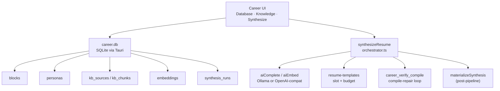
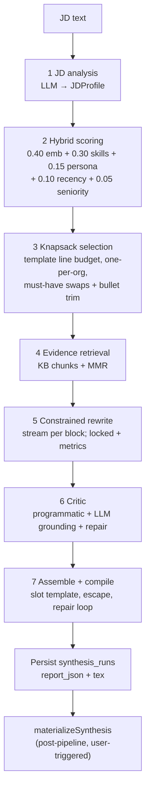

# Resume Synthesis Platform

Pipeline-focused companion for DevPrism’s **Master Career Database** and **JD-driven resume synthesis**.

**Authoritative system design & refactor spec:** [`CAREER_PLATFORM_DESIGN.md`](./CAREER_PLATFORM_DESIGN.md)

Entry points:

- Project Picker → Career
- Workspace → Command palette (“Open Career database”) or sidebar Career control

Tabs: **Database** · **Knowledge** · **Synthesize**.

This document mirrors the architecture in the working tree. Implementation paths are listed at the end.

## Architecture overview



Three layers:

| Layer | Responsibility |
|-------|----------------|
| **1 — Data schema & ingestion** | `career.db` document store; KB + resume ingest; SHA-1 incremental hashing |
| **2 — Context integration** | Heading-aware chunking → `aiEmbed` → brute-force cosine search; tag-only degradation |
| **3 — RAG / inference** | Seven-stage `synthesizeResume` → optional `materializeSynthesis` into workspace |

---

## Layer 1 — Master Career Database

**Location:** `~/Library/Application Support/DevPrism/career.db` (macOS; platform-specific via Tauri).

**Pattern:** Document store — full JSON in `json` / `meta_json` / `report_json`, with denormalized index columns for queries.

| Table | Role |
|-------|------|
| `blocks` | Experience / project / publication / education / leadership (`ExperienceBlock`) |
| `personas` | Targeting profiles (`ai`, `life-sciences`, `management` seeded) |
| `kb_sources` | Ingested knowledge-base documents |
| `kb_chunks` | Heading-aware text chunks with meta |
| `embeddings` | f32 BLOB vectors (`owner_kind`: `block` \| `chunk` \| `bullet`) |
| `synthesis_runs` | JD hash + persona + template + match report (+ optional `.tex`) history |

Schema: `apps/desktop/src-tauri/src/career_db/schema.rs`.  
Types: `apps/desktop/src/lib/career/types.ts`.

### Experience blocks

| Field | Notes |
|-------|--------|
| `kind` | `experience` \| `project` \| `publication` \| `education` \| `leadership` |
| `title`, `org`, `dateRange` | Display / recency |
| `personas[]`, `domains[]` | Targeting filters |
| `skills[{name, level 1–5, years?}]` | Tag scoring |
| `seniorityLevel` | Seniority fit component |
| `bullets[]` | See below |
| `embeddingText` | title + org + domains + canonical bullets (vector search) |

**Bullets:**

| Field | Behavior |
|-------|----------|
| `canonical` | Ground-truth phrasing |
| `variants` | Optional per-persona spins |
| `metrics[]` | Strings that **must** survive rewrites verbatim |
| `evidenceRefs[]` | KB chunk ids |
| `locked` | Selectable but never re-phrased by AI |

### Personas

| Id | Focus | Default section emphasis |
|----|--------|---------------------------|
| `ai` | ML / systems / measurable model outcomes | experience → projects → skills → education → publications |
| `life-sciences` | Scientific rigor, assays, pipelines | experience → publications → projects → skills → education |
| `management` | Scope, teams, stakeholder delivery | experience → leadership → skills → projects → education → publications |

Each persona stores `skillWeights`, `toneDirective`, `sectionOrder`, and `defaultTemplateId` (UI: template select from the resume-templates registry). Seeds use `INSERT OR IGNORE` so user edits are never overwritten.

### Ingestion formats

| Source | Chunker | Notes |
|--------|---------|--------|
| Markdown / Obsidian | `ingest/markdown.ts` | Heading-aware sections |
| PDF | `ingest/pdf.ts` | MuPDF text extraction |
| OPML / FreeMind | `ingest/mindmap.ts` | Outline → sections |
| BibTeX / Zotero | `ingest/zotero.ts` | Publication seed |
| Pasted / wizard resume | `extract-resume.ts` | LLM extraction → draft blocks |

Pipeline: `ingest/pipeline.ts` — parse → chunk → hash → upsert → embed (with `ProcessingProgress` callbacks).

---

## Layer 2 — Context integration

### Chunking

- Heading-aware windows of **~200–400 tokens** (~800–1600 chars at 4 chars/token)
- **15% overlap** within a heading path
- **Never merges** across different heading paths
- Per-chunk SHA-1 `contentHash` enables incremental re-ingest and embedding reuse

### Embeddings

- Frontend: `aiEmbed` → Tauri `ai_embed`
- Default local model: Ollama `nomic-embed-text`
- Cloud: Gemini / OpenAI embeddings when the OpenAI-compat credential supports them (Groq does not)
- Failures **defer gracefully** — chunks/blocks stay stored; synthesis continues in tag-only scoring
- Retrieval: brute-force cosine in Rust with optional persona / domain / kind filters (adequate at personal-DB scale; no ANN)

**Owner kinds (all implemented):**

| `ownerKind` | When written | Used by |
|-------------|--------------|---------|
| `chunk` | KB ingest / backfill | Evidence retrieval (stage 4) |
| `block` | Block save / “Embed all blocks” / backfill | Hybrid scoring (stage 2) |
| `bullet` | Block save / backfill | Bullet trim relevance (stage 3) |

### Degradation: `semanticMatchingDisabled`

When JD facet embedding fails or returns empty vectors, `JdFacets.semanticMatchingDisabled` is set `true` and a notice is attached. Scoring **renormalizes** weights with embedding → 0 (skills / persona / recency / seniority only). Evidence retrieval returns empty; rewrite still runs on canonical + JD context. Match reports surface this in the UI banner.

---

## Layer 3 — Seven-stage RAG pipeline

Orchestrator: `apps/desktop/src/lib/resume-synthesis/orchestrator.ts`.  
Structured LLM calls: `llmJson` → `aiComplete` (JSON mode, salvage-parse + one reprompt).  
Rewrite prefers `aiCompleteStream` with `llmJson` fallback.



| Stage | Module | LLM / embed calls (typical) | Output |
|-------|--------|------------------------------|--------|
| 1 JD analysis | `jd-analysis.ts` | 1× `llmJson` | Must/nice skills, domains, ATS keywords, tone |
| 2 Hybrid score | `scoring.ts` | 1× `aiEmbed` (3 JD facets) + vector search | Explainable component scores |
| 3 Knapsack | `selection.ts` | Bullet vector search (optional) | Selected set under `ResumeTemplateBudget` |
| 4 Evidence | orchestrator + MMR | Per-block chunk search + embed for MMR | Grounding snippets |
| 5 Rewrite | `rewrite.ts` | 1× stream/`llmJson` per selected block | Plain-text bullets only (no LaTeX) |
| 6 Critic | `critic.ts` | 1× critic + ≤2 repair rounds | Grounding / ATS coverage |
| 7 Assemble | templates + `compile-verify.ts` | Compile loop (no LLM) | Escaped `.tex` + PDF when engine succeeds |

**Post-pipeline (not a numbered stage):** `materializeSynthesis` writes the `.tex` into a variant or new project and opens the workspace. Rematerialization of a stored run reuses persisted `tex` without re-running LLM stages.

### Prompting & guards

| Guard | Behavior |
|-------|----------|
| Locked bullets | Copied verbatim; never sent for creative rewrite |
| Metrics | Every `metric.value` must appear verbatim or rewrite falls back to canonical |
| No LaTeX from AI | Rewrite/critic reject `\\command` and raw `{` `}`; only escaped slots enter TeX |
| Preamble lock | Template preamble concatenated as-is; models never see or edit it |
| Character budget | Per-bullet length capped by template `perBullet` |
| Tone / persona | Persona `toneDirective` + JD tone signals in rewrite/critic prompts |
| Critic | Programmatic invariants + LLM grounding; flagged bullets repaired or reverted |
| Compile repair | Culprit slots reverted to canonical plain text and re-escaped |

### Templates (slot / budget contract)

| Id | Layout |
|----|--------|
| `ats-single-column` | Single column (default ATS) |
| `ats-two-column` | Header full-width; left minipage (skills / education / leadership); right (summary / experience / projects / publications) |

Contract: audited `preamble` (AI never touches) · `sections` · `budget` · optional `layout`. Assembly escapes every AI-facing string via `escapeAndValidateSlot`; compile failures map engine line → slot and bisect/revert.

---

## Feature spec — progress, cancellation, rematerialization

### Unified `ProcessingProgress`

Shared type (ingest / embed / UI):

```ts
type ProcessingPhase =
  | "parse" | "chunk" | "hash" | "upsert" | "embed" | "done" | "error";

interface ProcessingProgress {
  phase: ProcessingPhase;
  current: number;   // 1-based item or batch index
  total: number;
  itemLabel?: string;
  bytes?: number;
  chunks?: number;
  detail?: string;
}
```

- **Knowledge tab / file ingest:** per-file rows with phase labels, chunk counts, embed batch progress, success / deferred / error.
- **Embed all blocks / import wizard commit:** block N of M (and embed batch within).
- **Synthesis:** existing stage badges + rewrite checklist; **live** elapsed wall-clock and per-stage timings from `MatchReport.stageTimingsMs` (partial during run, final after).

Progress stays **frontend-driven** (TS orchestration). Rust career commands remain request/response — no Rust progress events.

### Cancellation

- `AbortSignal` on `synthesizeResume` options; checked between stages and inside rewrite loops.
- `synthesis-store.cancel()` aborts the active controller; UI Cancel button while `running`.
- Terminal stage id: `cancelled` (alongside `done` / `error`). Abort throws; store maps abort → `cancelled` without treating it as a hard failure toast unless desired.

### Run rematerialization

- On successful synthesis, `report_json` persists the `MatchReport` **plus** `tex` (generated LaTeX) so history can reopen without re-running the LLM pipeline.
- “Open stored run” loads report + tex into the synthesis store; **Open in workspace** calls `materializeSynthesis` with that tex.
- Older runs without `tex` show report-only (Open in workspace disabled until re-run).

---

## Known invariants

1. AI emits **plain text only** into slots; LaTeX is produced solely by escape + audited macros.
2. Compile-verify may only mutate **slot content**, never the preamble or column scaffolding.
3. Knapsack respects template budget and prefers ≤1 block per org (unless a challenger clears the score gap).
4. Embedding failures must not abort synthesis — degrade via `semanticMatchingDisabled`.
5. Persona seed is insert-once; user persona JSON is authoritative after first edit.
6. `synthesis_runs` store the match report (+ tex when available) for audit; blocks remain the source of truth.
7. `materializeSynthesis` is user-triggered and post-pipeline — not part of the seven stages.

## Key source paths

| Area | Path |
|------|------|
| Career UI | `apps/desktop/src/components/career/` |
| Career client + types | `apps/desktop/src/lib/career/` |
| KB ingest | `apps/desktop/src/lib/career/ingest/` |
| Block/bullet embeddings | `apps/desktop/src/lib/career/block-embed.ts` |
| Synthesis pipeline | `apps/desktop/src/lib/resume-synthesis/` |
| Templates | `apps/desktop/src/lib/resume-templates/` |
| Career SQLite host | `apps/desktop/src-tauri/src/career_db/` |
| Compile verify command | `apps/desktop/src-tauri/src/career_compile.rs` |
| Progress UI store | `apps/desktop/src/stores/synthesis-store.ts` |

## Out of scope (by design)

Historical “out of scope” notes below are superseded by the gap workstreams in [`CAREER_PLATFORM_DESIGN.md`](./CAREER_PLATFORM_DESIGN.md) §4 (sqlite-vec ANN, Claude/Cursor backends, cancellation/progress, BibTeX publication blocks, embedding hygiene, UI tests). Still out of scope unless promoted there:

- Rust-side progress event streams
- Changing the seven-stage pipeline shape without a design revision
