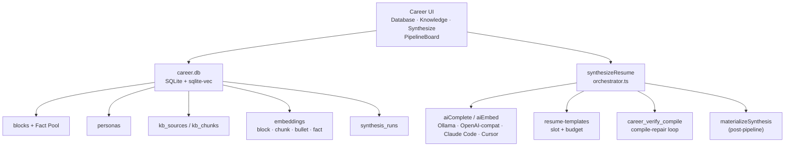
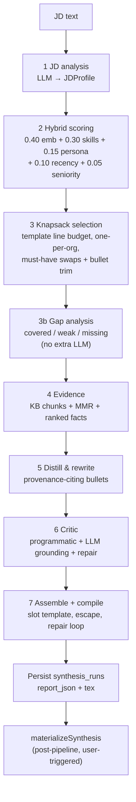

# Resume Synthesis Platform

Pipeline-focused companion for DevPrism’s **Master Career Database** and **JD-driven resume synthesis** (v2).

**Authoritative system design & refactor spec:** [`CAREER_PLATFORM_DESIGN.md`](./CAREER_PLATFORM_DESIGN.md)

Entry points:

- Project Picker → Career
- Workspace → Command palette (“Open Career database”) or sidebar Career control
- Space quick action “Synthesize resume”

Tabs: **Database** · **Knowledge** · **Synthesize** (`openCareer()` remembers last tab).

This document mirrors the architecture in the working tree. Implementation paths are listed at the end.

## Architecture overview



Three layers:

| Layer | Responsibility |
|-------|----------------|
| **1 — Data schema & ingestion** | `career.db` document store; Fact Pool (`facts[]` / `notes`); KB + resume / quick-points ingest; SHA-1 incremental hashing |
| **2 — Context integration** | Heading-aware chunking → `aiEmbed` → sqlite-vec ANN with cosine fallback; fact embeddings; tag-only degradation |
| **3 — RAG / inference** | Seven-stage `synthesizeResume` (+ stage 3b gap analysis, stage 5 distill & rewrite) → optional `materializeSynthesis` |


## Engine

**Typst is the only resume engine.** The LaTeX resume path (`ats-single-column`,
`ats-two-column`, `latex-escape.ts`, the compile-repair loop and
`career_verify_compile`) was removed once Typst proved better on every axis:

| | Typst (now) | LaTeX resume path (removed) |
|---|---|---|
| Command | `career_typst_compile` | `career_verify_compile` |
| Execution | in-process crate | app binary re-spawned as a Tectonic subprocess |
| Warm compile | **0.6 ms** | subprocess + cold temp dir every call |
| Text safety | code-mode string literals — injection impossible by construction | escaped into markup; needed bisect/repair |
| Repair loop | none needed | render -> verify -> bisect -> revert -> retry |
| PDF | tagged (PDF/UA-capable) | untagged |

Templates: `typst-ats-single-column`, `typst-ats-two-column`
(`apps/desktop/src/lib/resume-templates/typst-ats.ts`).
Engine: `apps/desktop/src-tauri/src/career_typst/`.

**Legacy ids.** Personas are rewritten on career-DB open
(`migrate_persona_templates`); `canonicalTemplateId` additionally maps
`ats-single-column` / `ats-two-column` onto their Typst replacements so a
stored run never fails with "Unknown resume template". Stored runs keep their
original LaTeX `tex`, and materialization writes `.tex` for them.

**Code-mode invariant.** Every AI/user value is emitted as a Typst string
literal inside the document's single `#{ … }` block. Literals are only
literals in code mode — in markup `#` still opens code mode. See
`typst-escape.ts`, `assertCodeModeOnly`, and the Rust test
`markup_splicing_is_unsafe_which_is_why_we_use_code_mode`.

**Workspace editing.** `.typ` is a first-class `ProjectFileType` (not `tex` —
SyncTeX, latexdiff and the rich editor are LaTeX-only and must not receive
Typst). `lib/compile-targets.ts` is the single owner of "which document builds,
with which engine"; `compileTargetToPdf` in `lib/project-compile.ts` is the
single dispatch point. Typst roots come from an import graph
(`lib/typst-project.ts`) since Typst has no `\documentclass` marker. Editor
highlighting is a hand-written `StreamLanguage` in `lib/editor/typst-language.ts`
(no CodeMirror 6 Typst grammar exists on npm).

Still LaTeX-only, by nature: SyncTeX forward/inverse sync, latexdiff
track-changes export, the rich (Word-like) editor, compile profiles, and the
LaTeX autocomplete/linter.

**Cross-language fixtures.** `npx vitest run
src/__tests__/lib/typst-fixtures.emit.test.ts` writes the documents the TS
templates actually emit into `src-tauri/tests/fixtures/typst/`; the Rust test
`rendered_fixtures_compile` compiles all of them. This is the only check that
the renderer and the compiler agree.

---

## Layer 1 — Master Career Database

**Location:** `~/Library/Application Support/DevPrism/career.db` (macOS; platform-specific via Tauri).

**Pattern:** Document store — full JSON in `json` / `meta_json` / `report_json`, with denormalized index columns for queries.

| Table | Role |
|-------|------|
| `blocks` | Experience / project / publication / education / leadership (`ExperienceBlock` + Fact Pool) |
| `personas` | Targeting profiles (`ai`, `life-sciences`, `management` seeded) |
| `kb_sources` | Ingested knowledge-base documents |
| `kb_chunks` | Heading-aware text chunks with meta |
| `embeddings` | f32 BLOB vectors; PK `(owner_id, model)`; `owner_kind`: `block` \| `chunk` \| `bullet` \| `fact` |
| `synthesis_runs` | JD hash + persona + template + match report (+ optional `.tex`) history |

Schema: `apps/desktop/src-tauri/src/career_db/schema.rs`.  
Types: `apps/desktop/src/lib/career/types.ts`.

### Experience blocks

| Field | Notes |
|-------|--------|
| `kind` | `experience` \| `project` \| `publication` \| `education` \| `leadership` |
| `title`, `org`, `dateRange` | Display / recency |
| `personas[]`, `domains[]` | Targeting filters |
| `skills[{name, level 1–5, years?}]` | Tag scoring |
| `seniorityLevel` | Seniority fit component |
| `bullets[]` | Canonical ground truth + metrics / locked |
| `facts[]` | Fact Pool — raw points for JD distillation |
| `notes?` | Scratchpad for “Distill with AI” |
| `embeddingText` | title + org + domains + canonical bullets + **fact texts** |

**Bullets:**

| Field | Behavior |
|-------|----------|
| `canonical` | Ground-truth phrasing |
| `variants` | Optional per-persona spins |
| `metrics[]` | Strings that **must** survive rewrites verbatim |
| `evidenceRefs[]` | KB chunk ids |
| `locked` | Selectable but never re-phrased by AI |

**Facts (`BlockFact`):**

| Field | Behavior |
|-------|----------|
| `text` | One raw detail point (ground truth) |
| `skills[]` | Optional tags for must-have targeting |
| `metrics[]` | Must survive verbatim when distilled |
| `source` | `manual` \| `distilled` \| `import` |

Ingest: block editor (manual + Distill with AI), Synthesize **Quick points** dialog, resume import (optional facts).

### Personas

| Id | Focus | Default section emphasis |
|----|--------|---------------------------|
| `ai` | ML / systems / measurable model outcomes | experience → projects → skills → education → publications |
| `life-sciences` | Scientific rigor, assays, pipelines | experience → publications → projects → skills → education |
| `management` | Scope, teams, stakeholder delivery | experience → leadership → skills → projects → education → publications |

Each persona stores `skillWeights`, `toneDirective`, `sectionOrder`, and `defaultTemplateId` (UI: template select from the resume-templates registry). Seeds use `INSERT OR IGNORE` so user edits are never overwritten.

### Ingestion formats

| Source | Chunker / path | Notes |
|--------|----------------|--------|
| Markdown / Obsidian | `ingest/markdown.ts` | Heading-aware sections |
| PDF | `ingest/pdf.ts` | MuPDF text extraction |
| OPML / FreeMind | `ingest/mindmap.ts` | Outline → sections |
| BibTeX / Zotero | `ingest/zotero.ts` | KB publication chunks |
| BibTeX → blocks | `publication-import-wizard.tsx` | `kind: "publication"` blocks |
| Pasted / wizard resume | `extract-resume.ts` | LLM → draft blocks (+ facts) |
| Quick points | `distill-facts.ts` | Paste → structured facts on a block |

Pipeline: `ingest/pipeline.ts` — parse → chunk → hash → upsert → embed (with `ProcessingProgress` callbacks).

---

## Layer 2 — Context integration

### Chunking

- Heading-aware windows of **~200–400 tokens** (~800–1600 chars at 4 chars/token)
- **15% overlap** within a heading path
- **Never merges** across different heading paths
- Per-chunk SHA-1 `contentHash` enables incremental re-ingest and embedding reuse

### Embeddings

- Frontend: `aiEmbed` → Tauri `ai_embed`
- Default local model: Ollama `nomic-embed-text`
- Cloud: Gemini / OpenAI embeddings when the OpenAI-compat credential supports them (Groq does not)
- Failures **defer gracefully** — chunks/blocks stay stored; synthesis continues in tag-only scoring
- Retrieval: sqlite-vec ANN KNN with over-fetch/post-filter; brute-force cosine fallback; optional persona / domain / kind filters
- Composite PK `(owner_id, model)` — switching models keeps both rows; search is scoped to one model

**Owner kinds (all implemented):**

| `ownerKind` | When written | Used by |
|-------------|--------------|---------|
| `chunk` | KB ingest / backfill | Evidence retrieval (stage 4) |
| `block` | Block save / “Embed all blocks” / backfill | Hybrid scoring (stage 2) |
| `bullet` | Block save / backfill | Bullet trim relevance (stage 3) |
| `fact` | Block save / `backfillFactEmbeddings` | Fact ranking (stage 4 → 5 distill) |

`resolve_hit_text` returns text for chunk, block, bullet, and fact. Deleting a block removes block + child bullet + fact embedding rows.

### Degradation: `semanticMatchingDisabled`

When JD facet embedding fails or returns empty vectors, `JdFacets.semanticMatchingDisabled` is set `true` and a notice is attached. Scoring **renormalizes** weights with embedding → 0 (skills / persona / recency / seniority only). Evidence / fact cosine ranking degrades; distill still runs on canonical + facts + JD context. Match reports surface this in the UI banner.

---

## Layer 3 — Seven-stage RAG pipeline (+ 3b)

Orchestrator: `apps/desktop/src/lib/resume-synthesis/orchestrator.ts`.  
Structured LLM calls: `llmJson` → `aiComplete` (JSON mode, salvage-parse + one reprompt).  
Distill/rewrite prefers `aiCompleteStream` with `llmJson` fallback.



| Stage | Module | LLM / embed calls (typical) | Output |
|-------|--------|------------------------------|--------|
| 1 JD analysis | `jd-analysis.ts` | 1× `llmJson` (stream preview) | Must/nice skills, domains, ATS keywords, tone |
| 2 Hybrid score | `scoring.ts` | 1× `aiEmbed` (3 JD facets) + vector search | Explainable component scores |
| 3 Knapsack | `selection.ts` | Bullet vector search (optional) | Selected set under `ResumeTemplateBudget` |
| 3b Gap analysis | `gap-analysis.ts` | None | `gapAnalysis` — covered / weak / missing + suggestions |
| 4 Evidence | orchestrator + MMR | Per-block chunk search + fact ranking | Grounding snippets + `blockFacts` |
| 5 Distill & rewrite | `rewrite.ts` | 1× stream/`llmJson` per selected block | Plain-text bullets with provenance |
| 6 Critic | `critic.ts` | 1× critic + ≤2 repair rounds | Grounding / ATS coverage |
| 7 Assemble | templates + `compile-verify.ts` | Compile loop (no LLM) | Escaped `.tex` + PDF when engine succeeds |

**Post-pipeline (not a numbered stage):** `materializeSynthesis` writes the `.tex` into a variant or new project and opens the workspace. Rematerialization of a stored run reuses persisted `tex` without re-running LLM stages.

### Stage 3b — Gap analysis

Pure TS. For each `mustHaveSkill`, classify coverage across selected blocks, the full pool, facts, and KB using `skillsMatch` / `textCoversSkill`. Results live on `MatchReport.gapAnalysis` and drive the “What’s missing” panel.

### Stage 5 — Distill & rewrite + provenance

- Prompt input: canonical bullets + ranked facts + KB evidence + JD + persona tone + budget.
- Contract: `{"bullets":[{"id","text","sourceFactIds","sourceBulletId"}]}` — every bullet cites provenance; fact-only distill allowed up to the trim cap.
- Invariants: cited ids must exist; metrics from cited facts/bullets preserved; no LaTeX; locked bullets unchanged; invalid → canonical fallback.
- Report fields: `bulletProvenance`, `blockFacts`, `blockEvidence`, optional `blockDiffs`.

### Prompting & guards

| Guard | Behavior |
|-------|----------|
| Locked bullets | Copied verbatim; never sent for creative rewrite |
| Metrics | Every cited `metric.value` must appear verbatim or rewrite falls back / drops fact-only bullet |
| Provenance | `sourceFactIds` / `sourceBulletId` must refer to known ids |
| No LaTeX from AI | Rewrite/critic reject `\\command` and raw `{` `}`; only escaped slots enter TeX |
| Preamble lock | Template preamble concatenated as-is; models never see or edit it |
| Character budget | Per-bullet length capped by template `perBullet` |
| Tone / persona | Persona `toneDirective` + JD tone signals in distill/critic prompts |
| Critic | Programmatic invariants + LLM grounding; flagged bullets repaired or reverted |
| Compile repair | Culprit slots reverted to canonical plain text and re-escaped; exhausted retries → soft-fail `compileOk: false` |

### Templates (slot / budget contract)

| Id | Layout |
|----|--------|
| `ats-single-column` | Single column (default ATS) |
| `ats-two-column` | Header full-width; left minipage (skills / education / leadership); right (summary / experience / projects / publications) |

Contract: audited `preamble` (AI never touches) · `sections` · `budget` · optional `layout`. Assembly escapes every AI-facing string via `escapeAndValidateSlot`; compile failures map engine line → slot and bisect/revert.

---

## Feature spec — progress, cancellation, rematerialization

### PipelineBoard (always visible)

`PipelineBoard` on the Synthesize tab replaces the old `hasActivity`-gated progress UI:

| State | UI |
|-------|-----|
| Idle | Stage list with one-line descriptions |
| Blocked (`!canRun`) | Checklist + fix CTAs (JD ≥ 40 chars, blocks exist, AI ready, persona/template) |
| Running | Live stages, elapsed, stream preview, rewrite checklist |
| Done / error / cancelled | Timings + badges; can view stored run |

Supporting UX: `AiReadinessCard` (skeleton while probing), Knowledge panel loading state, auto-open latest stored run when idle, per-block before/after diffs with provenance chips, “What’s missing” from `gapAnalysis`.

### Unified `ProcessingProgress`

Shared type (ingest / embed / UI):

```ts
type ProcessingPhase =
  | "parse" | "chunk" | "hash" | "upsert" | "embed" | "done" | "error";

interface ProcessingProgress {
  phase: ProcessingPhase;
  current: number;   // 1-based item or batch index
  total: number;
  itemLabel?: string;
  bytes?: number;
  chunks?: number;
  detail?: string;
}
```

- **Knowledge tab / file ingest:** per-file rows with phase labels, chunk counts, embed batch progress, success / deferred / error.
- **Embed all blocks / import wizard commit:** block N of M (and embed batch within).
- **Synthesis:** PipelineBoard + rewrite checklist; **live** elapsed wall-clock and per-stage timings from `MatchReport.stageTimingsMs` (partial during run, final after).

Progress stays **frontend-driven** (TS orchestration). Rust career commands remain request/response — no Rust progress events.

### Cancellation

- `AbortSignal` on `synthesizeResume` options; checked between stages and inside rewrite loops.
- Mid-LLM cancel via `aiComplete` / `aiCompleteStream` / `llmJson` → `ai_cancel_request`.
- `synthesis-store.cancel()` aborts the active controller; UI Cancel button while `running`.
- Terminal stage id: `cancelled` (alongside `done` / `error`).

### Run rematerialization

- On successful synthesis, `report_json` persists the `MatchReport` **plus** `tex` (generated LaTeX) so history can reopen without re-running the LLM pipeline.
- “Open stored run” loads report + tex into the synthesis store; **Open in workspace** calls `materializeSynthesis` with that tex.
- Older runs without `tex` show report-only (Open in workspace disabled until re-run). Provenance / gap fields are optional on older runs — UI hides chips/panels gracefully.

### Provider routing

Completions honor the selected chat provider (Ollama / OpenAI-compat / Claude Code / Cursor). Embeddings stay Ollama/cloud. CLI backends may not stream — UI shows a waiting/heartbeat panel instead of a frozen progress bar.

---

## Known invariants

1. AI emits **plain text only** into slots; LaTeX is produced solely by escape + audited macros.
2. Compile-verify may only mutate **slot content**, never the preamble or column scaffolding.
3. Knapsack respects template budget and prefers ≤1 block per org (unless a challenger clears the score gap).
4. Embedding failures must not abort synthesis — degrade via `semanticMatchingDisabled`.
5. Persona seed is insert-once; user persona JSON is authoritative after first edit.
6. `synthesis_runs` store the match report (+ tex when available) for audit; blocks remain the source of truth.
7. `materializeSynthesis` is user-triggered and post-pipeline — not part of the seven stages.
8. Distilled bullets must cite existing fact/bullet ids; metrics from cited provenance survive verbatim or the bullet falls back / is dropped.

## Key source paths

| Area | Path |
|------|------|
| Career UI | `apps/desktop/src/components/career/` |
| Synthesize UX | `apps/desktop/src/components/career/synthesize/` |
| Career client + types | `apps/desktop/src/lib/career/` |
| Fact distill (ingest) | `apps/desktop/src/lib/career/distill-facts.ts` |
| KB ingest | `apps/desktop/src/lib/career/ingest/` |
| Block/bullet/fact embeddings | `apps/desktop/src/lib/career/block-embed.ts` |
| Synthesis pipeline | `apps/desktop/src/lib/resume-synthesis/` |
| Gap analysis | `apps/desktop/src/lib/resume-synthesis/gap-analysis.ts` |
| Templates | `apps/desktop/src/lib/resume-templates/` |
| Career SQLite host | `apps/desktop/src-tauri/src/career_db/` |
| Compile verify command | `apps/desktop/src-tauri/src/career_compile.rs` |
| Progress UI store | `apps/desktop/src/stores/synthesis-store.ts` |

## Out of scope (by design)

Still out of scope unless promoted by a new design revision in [`CAREER_PLATFORM_DESIGN.md`](./CAREER_PLATFORM_DESIGN.md):

- Rust-side progress event streams
- Changing hybrid weight defaults without a design revision
- Cloud-hosted career DB or multi-user sync
